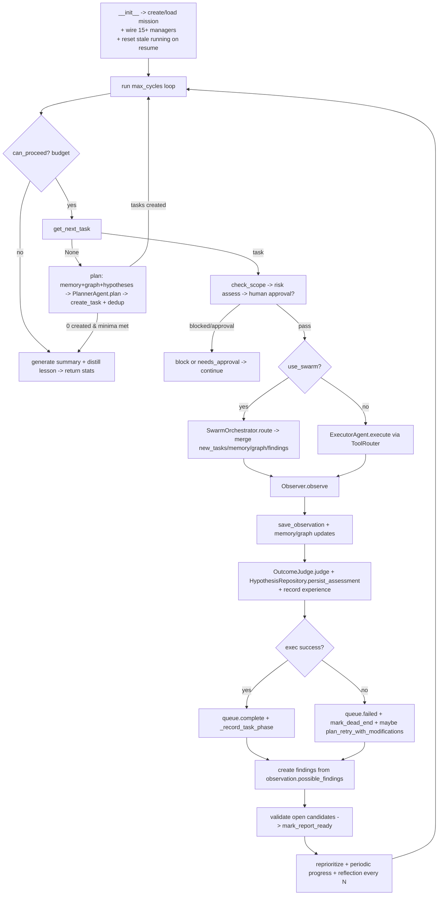

## Purpose

Orchestrates the full Flow B research workflow on top of the shared SQLite schema. Owns the `while cycles < max_cycles` loop that plans tasks, scope/risk-gates them, executes via swarm or `ExecutorAgent`, observes, judges hypothesis outcomes, updates memory/graph/evidence, validates findings, and generates reports. Supports fresh and resumed (`mission_id`) runs.

## Source Files

| File | Lines | Role |
|------|-------|------|
| `agent_loop.py` | ~1550 | `AgentLoop` class + autonomous campaign bridge |

Flow B file — frozen as `legacy` namespace per `docs/architecture.md` ADR-001; do not add new features here.

## Responsibilities

- Initialize and wire all Flow B managers from a mission config + workspace root + tool executor (`agent_loop.py:70` `__init__`): `DatabaseManager`, `MissionController`, `ScopeGate`, `RiskController`, `EvidenceStore`, `ToolRouter`, `MemoryManager` (+ `SemanticMemoryManager`), `ExperienceStore`, `TargetGraph`, `TaskQueue`, `HypothesisRepository`, `OutcomeJudge`, `PlannerAgent`, `ExecutorAgent`, `ObserverAgent`, `FindingVerifier`, `ReportGenerator`, `SwarmOrchestrator`.
- Implement resume: when `mission_id` is passed, `ensure_schema` + `load_mission` + `reset_stale_running` (`agent_loop.py:223`) + `SwarmOrchestrator.load_state` for the blackboard (`agent_loop.py:293`).
- Emit console + JSONL events (`agent_loop.py:370` `_emit_event` → `_console_event_handler` + `_persist_event`).
- Enforce phase minima (`agent_loop.py:1061` `_phase_minima_met`) before declaring research complete.
- Drive `run(max_cycles)` (`agent_loop.py:461`): budget check → `get_next_task` or `PlannerAgent.plan` → scope/risk gates → swarm or executor → observer → `OutcomeJudge.judge` + `HypothesisRepository.persist_assessment` → retry via `plan_retry_with_modifications` → finding validation → reprioritize.
- Bridge to `AutonomousOrchestrator` / `ReconPipeline` in `run_autonomous_campaign` (enhanced attack path).

## Public Interfaces

### Class `AgentLoop` (`agent_loop.py:61`)

#### Constructor

```python
AgentLoop(
    mission_config: dict,
    workspace_root: Path,
    tool_executor: Callable[[str, dict], str],
    human_approval_fn=None,
    console_ui=None,
    state_dir=None,
    mission_id=None,          # when set, RESUME existing mission
    original_target="",
    resolved_ip="",
)
```

Resolution logic (`agent_loop.py:99`): if `mission_id` given, `ensure_schema` then `load_mission(mission_id)` else `create_from_config(mission_config)`.

#### Properties

| Property | Location | Notes |
|----------|----------|-------|
| `mission` | `agent_loop.py:347` | `Mission` instance |
| `mission_id` | `agent_loop.py:351` | `str` id (`M-...`) |
| `cycles` | `agent_loop.py:355` | `int` completed cycles |

#### Methods

| Method | Location | Signature | Description |
|--------|----------|-----------|-------------|
| `set_model_client` | `agent_loop.py:358` | `(client, alias="glm")` | Inject LLM client for swarm + `reflection` / `experience` |
| `_emit_event` | `agent_loop.py:370` | `(event_type, data?)` | Fan-out to `event_callback`, console, and JSONL |
| `_console_event_handler` | `agent_loop.py:381` | `(event_type, data)` | `AttackUi`-aware rendering of swarm/critic/reflection events |
| `_persist_event` | `agent_loop.py:450` | `(event_type, data)` | Append to `swarm_events.jsonl` |
| `run` | `agent_loop.py:461` | `(max_cycles=50) -> dict` | Main loop; returns stats dict |
| `stop` | `agent_loop.py:1058` | `() -> None` | Sets `_running=False` |
| `_phase_minima_met` | `agent_loop.py:1061` | `() -> (bool, str)` | ≥2 recon, ≥`services_detected` service-enum, ≥`versions` vuln-research, ≥1 reporting |
| `_record_task_phase` | `agent_loop.py:1075` | `(task, result_text="")` | Update `_phase_counts` + parse banners |
| `run_autonomous_campaign` | `agent_loop.py:1091` | `async (targets) -> dict` | Deep recon → attack chaining via `AutonomousOrchestrator` |

Private helpers used across the loop: `_save_observation`, `_update_memory_from_observation`, `_update_graph_from_observation`, `_cross_mission_recall`, `_record_outcome_and_lesson`, `_distill_episode_summary` (`agent_loop.py:1343`, `agent_loop.py:1447`).

## Inputs/Outputs

| Input | Notes |
|-------|-------|
| `mission_config` | Dict with `allowed_assets`, `risk_profile`, `swarm.*`, `memory.*`, `outcome_judgment.*`, `attack_max_rounds` |
| `tool_executor` | `fn(tool_name, args) -> str` — called via `ToolRouter` after gates |
| `human_approval_fn` | `fn(tool_name, ctx) -> bool` for high-risk gated actions |

| Output | Notes |
|--------|-------|
| `stats` dict from `run()` | `tasks_created/completed/blocked/failed`, `observations`, `findings_created/validated/rejected/report_ready`, `evidence_saved`, `cycles` |
| `research.db` mutations | Tasks, hypotheses, assessments, observations, memories, graph, findings, audit |
| `state/swarm_state.json` + `swarm_events.jsonl` | Blackboard + event trail |
| `reports/summary_report.md` + per-finding `*.md` | Via `ReportGenerator` in `run()` tail |

## State/Persistence

- `workspace_root/research.db` — all managers share the same `DatabaseManager` + `mission_id`.
- `state_dir` (default `workspace_root/state`): `swarm_state.json` (blackboard), `swarm_events.jsonl` (event log).
- `_battle_log: list[dict]` bounded by `_max_battle_log = max(200, reflection_interval*4)` (`agent_loop.py:315`).
- Stale `running` tasks reset to `pending` on resume (`agent_loop.py:223` `reset_stale_running`).

## Configuration

| Key | Default | Wired to |
|-----|---------|----------|
| `attack_max_rounds` | `200` | `_max_cycles` |
| `reflection_every_n_actions` | `10` | `_reflection_interval` |
| `mission_config.use_swarm` | `True` | `_use_swarm` |
| `swarm.max_parallel_agents` | `3` | `SwarmOrchestrator(max_parallel)` |
| `swarm.negotiation_rounds` | `0` | `SwarmOrchestrator(negotiation_rounds)` |
| `critic_enabled` / `reflection_enabled` | `True` | Orchestrator flags |
| `memory.semantic_enabled` | `False` | Creates `SemanticMemoryManager` with `ollama.host`/`embed_host` |
| `memory.experience_min_samples` / `experience_time_decay_days` | `3` / `90.0` | `ExperienceStore` |
| `outcome_judgment.*` | | `OutcomeJudge` thresholds |

## Dependencies

- `db.DatabaseManager`, `mission.Mission`, `mission.MissionController`, `scope_gate.ScopeGate`, `risk_controller.RiskController`, `evidence.EvidenceStore`, `tool_router.ToolRouter`, `executor.ExecutorAgent`, `observer.ObserverAgent`, `outcome_judge.OutcomeJudge` + `HypothesisRepository`, `memory.MemoryManager`, `target_graph.TargetGraph`, `task_queue.TaskQueue`, `finding_verifier.FindingVerifier`, `report_generator.ReportGenerator`, `planner.PlannerAgent`, `tools.swarm.SwarmOrchestrator`, `tools.recon_pipeline.ReconPipeline` (in campaign), `tools.autonomous_orchestrator.AutonomousOrchestrator`, `tools.enhanced_reporting.EnhancedReportGenerator`, `tools.experience_store.ExperienceStore`, `tools.semantic_memory.SemanticMemoryManager`.

## Used By

- `cli.py: cmd_run_task` is a single-step manual analogue; `AgentLoop.run` is the autonomous multi-cycle version.
- Tests / ad-hoc runners constructing `AgentLoop(mission_config, workspace, executor_fn).run(...)`.

## Control Flow



## Failure Modes

| Failure | Handling |
|---------|----------|
| Scope blocked | `queue.block_task(reason)` + `task_blocked` event; continue |
| Risk blocked | `queue.block_task(reason)`; continue (covers `DANGEROUS_TOOL_PATTERNS` when `allow_exploitation=False`) |
| High-risk needs human approval (`ScopeGate` or `RiskController` sets `requires_human_approval`) | `queue.update_task_status(needs_approval)` + `human_approval_needed` event; caller handles |
| No materially different task (planner dedup + hypothesis terminal/duplicate check) | `DuplicateInvestigationError` / `ClosedHypothesisError` → `task_rejected` event; phase-minima gate decides termination |
| Budget exhausted | Loop break + `RiskController` `ai_thinking` event |
| `PlannerAgent.plan` returns 0 tasks | If `_phase_minima_met` true → done, else stays alive with “minima unmet” reasoning |
| `SwarmOrchestrator` exception | Wrapped inside `route`; surfaced as `Blocked/Failed` `AgentResult` |

## Invariants

- Every executed task runs through `ScopeGate` then `RiskController` (via `ToolRouter` or explicit checks); there is no direct `tool_executor` call in the loop.
- Hypothesis status never overwrites `ExecutionResult.success`; task `status` stays operational (`complete`/`failed`/`blocked`), hypothesis state lives separately in `hypotheses` + `outcome_assessments`.
- Confirmed / refuted / exhausted are terminal: `get_next_task` filters them out and `PlannerAgent` skips them.
- On resume, stale `running` → `pending` and prior `swarm_state.json` blackboard are restored before the first cycle.

## Security Boundaries

- Scope + risk gates are defense-in-depth even inside the swarm path: `SwarmOrchestrator` still routes through `ToolRouter` with `ScopeGate`/`RiskController` checks.
- Human approval is mandatory for `high` risk unless `risk_profile == "high_authorized_testing"`.
- Forbidden actions (`scope_gate._HARD_FORBIDDEN_ACTIONS`) and destructive patterns (`risk_controller._DESTRUCTIVE_PATTERNS`) block regardless of other state.

## Tests

| Test file | Covers |
|-----------|--------|
| `tests/test_agent_loop.py` | Cycle budget, phase minima, task lifecycle, resume reset, event fan-out |
| `tests/test_task_queue.py` | Queue behaviors exercised by loop |
| `tests/test_outcome_judge.py` | Judge + hypothesis persistence called per-cycle |
| `tests/test_swarm.py` / `tests/test_swarm_integration.py` / `tests/test_swarm_observability.py` | Swarm routing, blackboard, events |

Run: `python -m pytest tests/test_agent_loop.py tests/test_outcome_judge.py -v`

## Common Changes

| Change | Where |
|--------|-------|
| Adjust phase minima | `agent_loop.py:1061` `_phase_minima_met` |
| Change planner context | `agent_loop.py:504` target/graph/hypothesis shaping before `planner.plan` |
| Add a loop event | `agent_loop.py:370` `_emit_event` + `_console_event_handler` |
| Tune resume | `agent_loop.py:222` `reset_stale_running` + `agent_loop.py:293` `load_state` |

## Update This Document When

- `AgentLoop.__init__` wiring (new managers, config keys) changes.
- `run()` cycle ordering, phase minima, or swarm/executor branching changes.
- Resume or event/battle-log persistence is altered.

## Related Documentation

- `docs/runtime-flows.md` §Database-Backed Research Loop — loop rules in prose
- `docs/architecture.md` §Core Domain Services / Flow B Freeze
- `scope_gate.py` / `risk_controller.py` (`docs/components/flow-b/scope-risk.md`)
- `planner.py` / `task_queue.py` (`docs/components/flow-b/planner-queue.md`)
- `observer.py` / `outcome_judge.py` (`docs/components/flow-b/observer-outcome.md`)
- `tools/swarm/` (`docs/swarm.md`)
