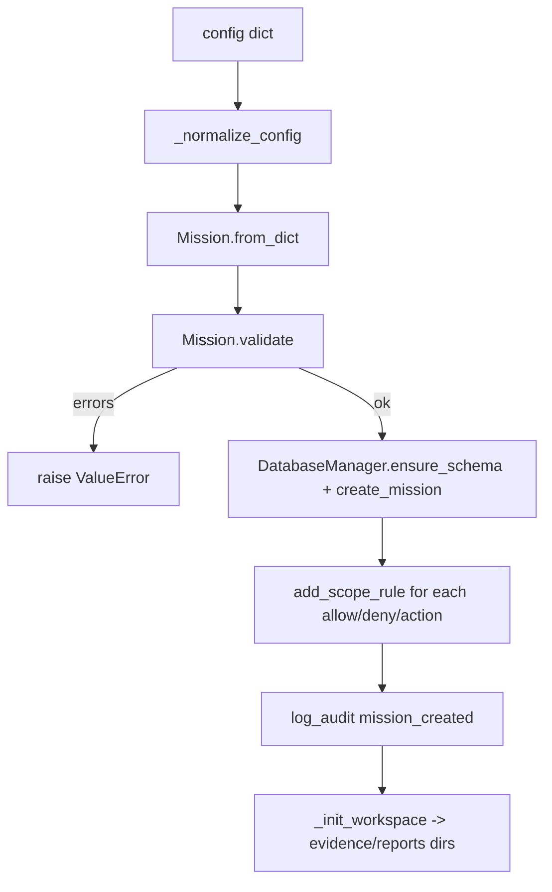

## Purpose

Shared kernel for both flows. `db.py` owns the single SQLite schema, migrations, ID/timestamp helpers, thread-safe connection management, and audit helpers. `mission.py` owns the `Mission` domain object, risk-profile policy, asset validation, config normalization, and workspace initialization. Together they define “what a mission is and where its data lives.”

## Source Files

| File | Lines | Role |
|------|-------|------|
| `db.py` | 1031 | DDL (13 tables + indexes), `DatabaseManager`, migrations v2–v10, global singleton |
| `mission.py` | 512 | `Mission` dataclass, `MissionController`, risk profiles, asset validation, workspace dirs |

Isolated DBs elsewhere (`tools/api/persistence.py` owns `api_runtime.db`); these two own `research_workspace/research.db`.

## Responsibilities

### `db.py`

- Declare full DDL for `missions`, `scope_rules`, `tasks`, `hypotheses`, `outcome_assessments`, `observations`, `graph_nodes/edges` (+ `graph_nodes_v2/edges_v2`), `evidence`, `findings`, `audit_logs`, `memories`, `embeddings`, `lessons`, etc. (`db.py:39` `DDL`).
- Provide `DatabaseManager(path, wal, foreign_keys)` with thread-local read+write connection cache (`db.py:327`), `connection(write)` context manager with 30 s write-lock (`db.py:358`), `ensure_schema(conn)` idempotent DDL + migrations (`db.py:376`), and 10 versioned migrations (`db.py:391` `_run_migration`).
- Offer high-level helpers: `create_mission`, `add_scope_rule`, `get_scope_rules`, `log_audit`, `close` (`db.py:920`).
- Expose singleton `get_default_db / set_default_path / reset_default` (`db.py:1006`).
- Generate IDs (`db.py:31` `_new_id(prefix)` → `{PREFIX}-{seq:05d}-{8hex}`) and timestamps (`db.py:27` `_now_iso` → ISO8601 UTC).

### `mission.py`

- Define three risk profiles in `_RISK_PROFILES` (`mission.py:21`): `low_noise_non_destructive` (safe recon; `max_commands=100`), `standard_authorized` (`200`), `high_authorized_testing` (`500`, allows exploitation + pivoting).
- Implement `Mission` dataclass (`mission.py:87`) whose `__post_init__` fills `mission_id`, `testing_modes`, and augments `forbidden_actions` with profile defaults (H18 union semantics, `mission.py:122`).
- Validate via `Mission.validate() -> list[str]` (`mission.py:195`) and `is_valid()`; strict asset-label DNS checks (`mission.py:243` `_LABEL_RE`).
- Normalize heterogeneous config shapes in `_normalize_config` (`mission.py:436`): `target_assets`, `scope.allow/deny`, `testing_modes`.
- Persist through `MissionController` (`mission.py:293`): `create_from_config` (normalize → `Mission` → `validate` → `ensure_schema` → `create_mission` + `add_scope_rule` for allow/deny/action + `log_audit` + `_init_workspace`), `_init_workspace` (creates `<mission_id>/evidence/*/reports/logs/tasks`), `load_mission(id)`, `update_status`, properties `active_mission_id/workspace_root`.
- Classify assets in `_classify_asset` (`mission.py:463`): `wildcard_domain` / `ip` / `cidr` / `url_prefix` / `domain`.

## Public Interfaces

### `db.py`

| Symbol | Location | Signature |
|--------|----------|-----------|
| `_now_iso` | `db.py:27` | `() -> str` |
| `_new_id` | `db.py:31` | `(prefix: str) -> str` |
| `DDL` | `db.py:39` | `str` — full schema |
| `DatabaseManager` | `db.py:317` | `(path, wal=True, foreign_keys=True)` |
| `DatabaseManager._get_conn` | `db.py:339` | `(write=False) -> Connection` |
| `DatabaseManager.connection` | `db.py:358` | `@contextmanager (write=False) -> Generator[Connection]` |
| `DatabaseManager.ensure_schema` | `db.py:376` | `(conn)` — DDL + migrations |
| `DatabaseManager.create_mission` | `db.py:920` | `(conn, **fields) -> {id, created_at}` |
| `DatabaseManager.add_scope_rule` | `db.py:951` | `(conn, mission_id, rule_type, target_type, pattern, notes="") -> str` |
| `DatabaseManager.get_scope_rules` | `db.py:967` | `(conn, mission_id) -> list[dict]` |
| `DatabaseManager.log_audit` | `db.py:976` | `(conn, mission_id, event_type, message="", task_id=None, metadata=None) -> str` |
| `DatabaseManager.close` | `db.py:992` | `()` — closes cached conns |
| `get_default_db` | `db.py:1006` | `() -> DatabaseManager` (from `RESEARCH_WORKSPACE` env) |
| `set_default_path` | `db.py:1023` | `(path) -> DatabaseManager` |
| `reset_default` | `db.py:1029` | `()` |
| Migrations | `db.py:416`–`db.py:914` | `v2_task_phases`, `v3_indexes`, `v4_outcome_judgment`, `v5_lessons_text`, `v6_graph_v2`, `v7_belief_state`, `v8_evidence_provenance`, `v9_decision_telemetry`, `v10_attempt_fingerprints` |

### `mission.py`

| Symbol | Location | Notes |
|--------|----------|-------|
| `_RISK_PROFILES` | `mission.py:21` | Dict of 3 profiles with `max_commands_per_session`, `max_tasks_active`, `default_rate_limit_rps`, `allows_exploitation/pivoting/credential_testing`, `forbidden_by_default`, `testing_modes` |
| `DEFAULT_OBJECTIVE` | `mission.py:73` | Stored default objective string |
| `Mission` | `mission.py:87` | Dataclass; fields `program_name`, `objective`, `mission_id`, `target_assets/allowed_assets/disallowed_assets/forbidden_actions/rate_limits/risk_profile/testing_modes/accounts/notes` |
| `Mission.__post_init__` | `mission.py:111` | Fills profile, id, modes, forbidden-augment |
| `Mission.allows_exploitation` etc. | `mission.py:130` | 6 profile-derived properties |
| `Mission.to_dict` / `from_dict` / `from_yaml_or_dict` | `mission.py:155` | Serialization |
| `Mission.validate` / `is_valid` | `mission.py:195` | Returns error list |
| `_validate_domain_labels` / `_validate_asset_string` | `mission.py:246` | DNS label + IP/CIDR/wildcard checks |
| `MissionController` | `mission.py:293` | `(db, workspace_root?)` |
| `MissionController.create_from_config` | `mission.py:310` | `(config, mission_id=None) -> Mission` |
| `MissionController._init_workspace` | `mission.py:384` | `(mission)` |
| `MissionController.load_mission` | `mission.py:403` | `(mission_id) -> Mission\|None` |
| `MissionController.update_status` | `mission.py:413` | `(mission_id, status in active/paused/completed)` |
| `_normalize_config` | `mission.py:436` | `(config) -> dict` |
| `_classify_asset` | `mission.py:463` | `(asset) -> str` |
| `_row_to_mission` / `_json_field` | `mission.py:484` | DB row → `Mission` |

## Inputs/Outputs

| Input | Notes |
|-------|-------|
| `mission.yaml` dict | `target_assets` / `allowed_assets` / `disallowed_assets` / `forbidden_actions` / `risk_profile` / `testing_modes` / `rate_limits` |
| `workspace_root` | `Path` — default `research_workspace/` or `RESEARCH_WORKSPACE` env |

| Output | Notes |
|--------|-------|
| `research.db` mutations | Single DB file at `workspace_root/research.db` (many missions) |
| `research_workspace/<mission_id>/` dirs | Evidence + reports + logs + tasks |
| `scope_rules` rows | One per `allowed_assets` + `disallowed_assets` + `forbidden_actions` (type `action`) |

## State/Persistence

Tables (via `DDL`):

- `missions` — program, objective, risk_profile, `*_json` fields, status (`active`/`paused`/`completed`), timestamps (+ `_migrations`).
- `scope_rules` — `rule_type∈(allow,deny)` × `target_type∈(domain,ip,cidr,wildcard_domain,url_prefix,action)`.
- Downstream tables owned elsewhere but DDL’d here: `tasks`, `hypotheses`, `outcome_assessments`, `observations`, `graph_nodes/edges` (+ v2), `evidence`, `findings`, `audit_logs`, `memories`, `embeddings`, `lessons`, `belief_transitions`, `evidence_references`, `decision_telemetry`, `attempt_fingerprints`.

ID format: `{PREFIX}-{seq:05d}-{8hex}` where seq = `time_ms % 100000`; prefix set: `M`,`S`,`T`,`HYP`,`JDG`,`E`,`F`,`A`,`MEM`,`GN`,`GE`.

WAL + `busy_timeout=5000` + `foreign_keys=ON` (unless disabled). Thread-local conn cache prevents per-call `sqlite3.connect`.

Migrations are idempotent and cumulative (`_SCHEMA_VERSION = 10`).

## Configuration

- `RESEARCH_WORKSPACE` env overrides default workspace path (both `get_default_db` and `cli._workspace_root`).
- `risk_profile` gates budgets/modes; invalid profile fails `validate`.
- No direct `config.yaml` dependency — `mission.yaml` is the input; `config.yaml` is Flow A.

## Dependencies

- `sqlite3`, `json`, `uuid`, `threading`, `pathlib`, `ipaddress`, `re`, `datetime`.
- Consumers: every Flow B module imports `db.DatabaseManager` (62 import sites) and `mission.Mission`/`MissionController`.

## Used By

- `cli.py` (`DatabaseManager`, `MissionController`, `Mission`)
- `agent_loop.py` (same + resume path)
- `scope_gate`, `risk_controller`, `task_queue`, `outcome_judge`, `memory`, `target_graph`, `evidence`, `finding_verifier`, `report_generator` — all take `(db, mission_id)`.

## Control Flow

Resume: `load_mission(id)` → `_row_to_mission` (json-loads `_json` columns) → no DDL re-init except `ensure_schema` before the SELECT on a fresh DB (agent_loop resume).

## Failure Modes

| Failure | Detection | Handling |
|---------|-----------|----------|
| Bad asset string | `_validate_asset_string` → `_LABEL_RE` | `validate` returns `Invalid scope entry ...` |
| Missing `program_name` or empty allow/target | `validate` | Error list includes required-field messages |
| Unknown `risk_profile` | `validate` | Lists valid profiles |
| `FOREIGN KEY` / `UNIQUE` violation | `sqlite3.IntegrityError` | Write lock (30 s timeout) else `TimeoutError`; `hypothesis_key` uniqueness enforced |
| Stale `running` tasks on crash | `tasks.status='running'` left | `TaskQueue.reset_stale_running` on resume |
| DB write contention | `threading.RLock` + `busy_timeout=5000` | Falls back to `TimeoutError` after 30 s |

## Invariants

- One `research.db` per workspace; missions are rows, not files.
- `forbidden_actions` is always the union of explicit list + profile `forbidden_by_default` (`mission.py:122`).
- `allowed_assets` alone is sufficient; `target_assets` is accept-listed for `create_from_config` and merged into `allowed_assets` (`_normalize_config`).
- Hard-blocked actions (`scope_gate._HARD_FORBIDDEN_ACTIONS`) are a superset — profile defaults never relax them.
- `_new_id` uniqueness relies on `time_ms` + `uuid4`; not monotonic, not sortable.

## Security Boundaries

- No network I/O, no command execution, no LLM calls in these modules.
- `validate` enforces per-label DNS hygiene (`_LABEL_RE` rejects `*.-.com`, `....`, leading/trailing hyphen).
- `scope_rules` with `target_type=action` encode forbidden actions as deny-rules for `ScopeGate.load_from_db`.

## Tests

| Test file | Covers |
|-----------|--------|
| `tests/test_mission.py` | `Mission.validate`, `_classify_asset`, normalization, controller creation, `_LABELEL` edge cases |
| `tests/test_evidence.py` | Schema creation via `ensure_schema`, persistence through `EvidenceStore` |
| `tests/test_agent_loop.py` | `create_from_config` wiring + budgets |
| `tests/test_resume_mission.py` | `load_mission` + stale-running reset on resume |
| `tests/test_cli_mission_id.py` | `--mission-id` load by id vs latest active |

Run: `python -m pytest tests/test_mission.py tests/test_evidence.py -v`

## Common Changes

| Change | Where |
|--------|-------|
| Add a risk profile | `mission.py:21` `_RISK_PROFILES` + `mission.py:195` validation |
| Add a table/column | `db.py:39` `DDL` + new `def _migrate_vN_...` + bump `_SCHEMA_VERSION` |
| Add a mission field | `mission.py:87` `Mission` dataclass + `db.py:45` `missions` DDL + `_row_to_mission`/`create_mission` |

## Update This Document When

- `_SCHEMA_VERSION` or `DDL` gains a table/column/index.
- `Mission` adds/removes a field, validation rule, or risk profile.
- `_normalize_config` or `_classify_asset` handling of a new config shape changes.
- `MissionController` workspace layout or status machine changes.

## Related Documentation

- `docs/database-mission.md` — DB layout + mission persistence in prose
- `docs/architecture.md` §Persistence / §Flow A CLI Orchestration (shared kernel)
- `cli.py` (`docs/components/root/cli.md`) — CLI over these same tables
- `agent_loop.py` (`docs/components/flow-b/agent-loop.md`) — loop that owns mission lifecycle
- `scope_gate.py` / `risk_controller.py` (`docs/components/flow-b/scope-risk.md`) — scope/risk consumers of `Mission`
