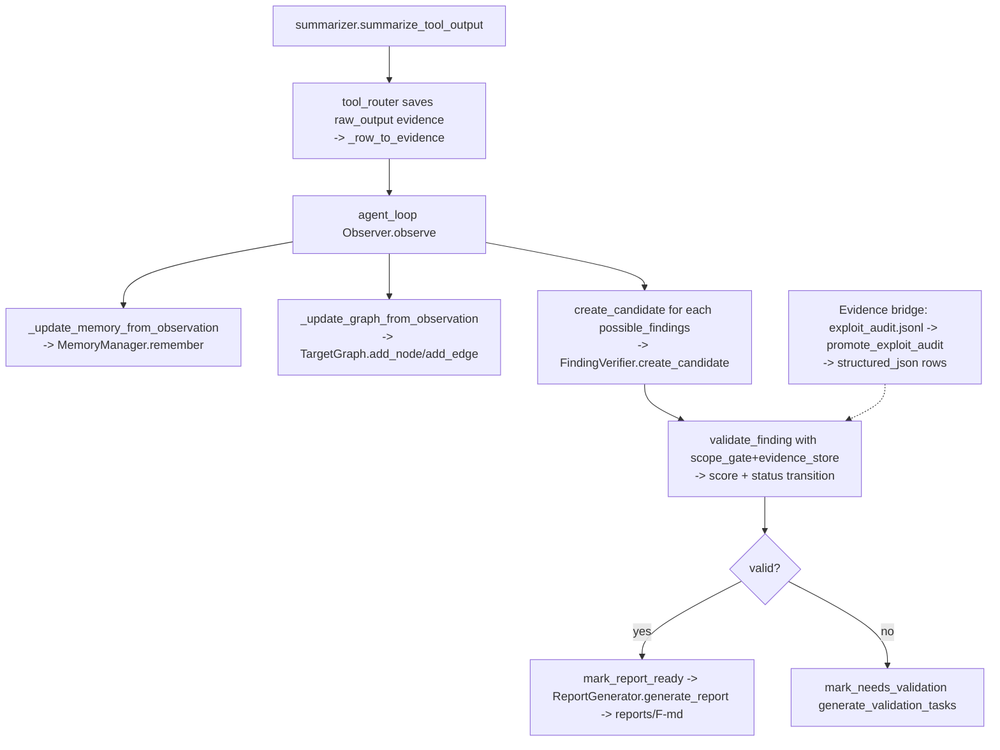

## Purpose

Durable knowledge layer: raw outputs → files (`EvidenceStore`), cross-run recollections (`MemoryManager` + `SemanticMemoryManager` embeddings), attack-surface graph (`TargetGraph`), candidate-to-report finding lifecycle (`FindingVerifier`), Markdown reports (`ReportGenerator`), and compact LLM-safe summaries (`summarizer`). Consumed by `AgentLoop`, `cli summarize-target/list-findings/...`, and the Flow-A→Flow-B evidence bridge.

## Source Files

| File | Lines | Responsibilities |
|------|-------|------------------|
| `evidence.py` | 420 | FS+SQLite store, `save/get/compare/list_*`, hash/truncate, `promote_exploit_audit`, `record_run_output` |
| `memory.py` | 269 | `MemoryManager` CRUD over `memories` + semantic fallback `retrieve_relevant` |
| `target_graph.py` | 237 | `TargetGraph` node/edge CRUD + `query_graph/summarize_graph` heuristics |
| `finding_verifier.py` | 460 | `FindingVerifier` lifecycle `candidate→needs_validation→validated→report_ready` (+ `rejected`/`duplicate_suspected`), `validate_finding`, impact scoring |
| `report_generator.py` | 380 | `ReportGenerator` templated `generate_report/export_report/generate_summary_report` |
| `summarizer.py` | 182 | `summarize_tool_output` by tool family + `summarize_observation` one-liner |

## Responsibilities

### `evidence.py` (`evidence.py:38` `EvidenceStore`)

- Map `evidence_type ∈(raw_output,http_response,http_request,screenshot,note,diff,file,structured_json)` → subdir via `_EVIDENCE_SUBDIRS` (`evidence.py:26`) → write `<E-...>.<ext>` (`evidence.py:91`), hash with SHA256 (`hashlib.sha256`, `evidence.py:81`), truncate >1 MB (`evidence.py:84`), summary snippet 300 chars (`evidence.py:100`).
- Persist metadata row `evidence(id, mission_id, task_id?, finding_id?, type, path, summary, hash, metadata_json)` (`evidence.py:108`) with `content_truncated`/`original_size` in metadata.
- Read back via `get(id)` (`evidence.py:126`) attaching `content` (base64 for `screenshot/file`, utf-8 otherwise). `compare/list_for_*` are thin queries (`evidence.py:147`).
- Bridge Flow A audit JSONL → evidence: `_audit_row_kind` (`evidence.py:264`), `_audit_hash_of`, `promote_exploit_audit(store, audit_path, mission_id, target_ip)` (`evidence.py:287` → one `structured_json` row per valid audit line, `source: exploit_audit`, `audit_kind=audit_hash/action/attempt_id`), `_promote_one_row`, `record_run_output` convenience (`evidence.py:380`).

### `memory.py` (`memory.py:53` `MemoryManager`)

- Define `VALID_MEMORY_TYPES={working,episodic,semantic,target,hypothesis,dead_end,finding_note}` + 10 aliases (`memory.py:23`) normalized via `_normalize_memory_type` (`memory.py:252`); alias stashing in `metadata.original_memory_type` + tag (`memory.py:78`).
- `remember(target,fact,type?,tags?,confidence?,metadata?)->id` (`memory.py:68`) writes `memories` and optionally `store_embedding(… memories)`.
- `retrieve(target?,type?,tags?,limit=20)` (`memory.py:112`) with `LIKE … ESCAPE` for `%/_` in tags, ordered `created_at DESC`.
- `retrieve_relevant(target, current_task_id?, limit=10, context="")` (`memory.py:143`): exact `retrieve` then semantic fallback `find_similar(context||target, top_k)` + merge dedup — **embeds context, not bare IP** (tier 1.1 fix).
- `mark_dead_end(target, reason, metadata?)` (`memory.py:191`) sugar; `summarize_target(target)->str` (`memory.py:203` counts by type + 10 recent lines); `get_open_hypotheses(target)->list[str]` (`memory.py:230`).

### `target_graph.py` (`target_graph.py:39` `TargetGraph`)

- Define `NODE_TYPES` 18 (`program,asset,host,domain,ip,service,web_app,api,endpoint,parameter,identity,role,session,object,permission_boundary,technology,evidence,finding`, `target_graph.py:25`) and `EDGE_TYPES` 14 (`owns,exposes,resolves_to,…,related_to`, `target_graph.py:31`).
- `add_node(node_type,value,metadata?,node_id?)` / `add_edge(from_node,to_node,relation,metadata?)` (`target_graph.py:48`) with validation; edges require existing node ids.
- `query_graph(node_type?,value_pattern?,relation?,limit=100)->{nodes,edges}` (`target_graph.py:99`), `find_untested_assets()` (hosts/ip/domain/web_app/api without `tested_by`), `find_permission_boundaries`, `find_object_id_candidates` (`%id%|%uuid%`), `summarize_graph()->str` (counts by `type`/`relation`, `target_graph.py:172`).

### `finding_verifier.py` (`finding_verifier.py:76` `FindingVerifier`)

- Define `VALID_STATUS_TRANSITIONS` (`candidate→{needs_validation,rejected,duplicate_suspected}`, …terminal `rejected`, `finding_verifier.py:32`), `VULN_CLASSES` 25, `_IMPACT_CATEGORIES` (`finding_verifier.py:67`).
- `create_candidate(title,asset,summary,vuln_class?,endpoint?,impact?,confidence?,evidence_refs?)->id` (`finding_verifier.py:85`) scores impact (`finding_verifier.py:314` `_score_impact`: base 20 + vuln/impact keyword bonuses, capped 100) into `findings`.
- Validate: `validate(id)->str` (`finding_verifier.py:129` needs `validated` transition + evidence), `validate_finding(id, scope_gate?, evidence_store?)->{valid,reason,missing,checks}` (`finding_verifier.py:145`) — 6 checks: in-scope (`scope_gate.check_scope` low/validate), `has_evidence`+on-disk, `summary>20`, `impact`, `vuln_class`, `reproduction_steps` (via `FindingAdapter.ensure_reproduction_steps` when empty, `finding_verifier.py:214`), auto-transitions `candidate|needs_validation→validated` on `valid`.
- Mutations: `reject`, `mark_report_ready` (requires `validated`), `mark_needs_validation`; queries `list_*`, `list_all(status?)` ordered `updated_at DESC`; scoring helpers `score_impact`, `_score_impact`, `generate_validation_tasks` (evidence/repro buckets).

### `report_generator.py` (`report_generator.py:138` `ReportGenerator`)

- Define `_severity_label` (`report_generator.py:39`: ≥80 Critical, ≥50 High, ≥30 Medium, ≥10 Low, else Informational) and `REPORT_TEMPLATE` (`report_generator.py:53` — 12 sections from Summary to Notes).
- `generate_report(finding_id)->str` (`report_generator.py:155`) requires `report_ready`; resolves severity, formats `affected_asset/endpoint`, `reproduction_steps`, `evidence` (`_format_list`/`_format_evidence`), exploit fields + suggested goals (from `suggested_goals_json`), braces-escaped, writes `reports/<finding_id>.md`.
- `export_report(finding_id)->dict` (`report_generator.py:259`) JSON shape; `generate_summary_report()->str` (`report_generator.py:282`) aggregates `report_ready/validated/candidate/rejected` counts → `reports/summary_report.md`.

### `summarizer.py`

- Tool-typed `summarize_tool_output(raw, tool_name, max_tokens≈char_budget)` (`summarizer.py:15`): routes `nmap/scan` → ` _summarize_nmap` (open ports list, OS), `search/exploit_db/cve` → strip HTML, `http/curl/web` → status + Server/Content-Type/Location/Set-Cookie + body size, `msf` → `[*]/[+]/[-]` lines, `python` → first 30 non-comment lines, `terminal/run_` → strip ANSI, exit_code, tail 5 meaningful lines, else generic (strip ANSI, 40 lines), caps with `_cap` truncation notice (`summarizer.py:161`).
- `summarize_observation(obs)->str` (`summarizer.py:167`) one-liner: `"{n} fact(s); {m} signal(s); …"` or `"no notable output"`.

## Public Interfaces

| Symbol | Location | Notes |
|--------|----------|-------|
| `EvidenceStore` | `evidence.py:38` | `(db, mission_id, workspace)` |
| `EvidenceStore.save` | `evidence.py:54` | `(type, content str\|bytes, metadata?, task_id?, finding_id?, target?) -> str` |
| `EvidenceStore.get` | `evidence.py:126` | `(id)->dict\|None` with `_binary` + `content` (base64 for binary types) |
| `EvidenceStore.compare` | `evidence.py:147` | `(a,b)->{comparable,same_hash,…}` |
| `EvidenceStore.list_for_task/finding/mission` | `evidence.py:163` | `(...)->list[dict]` |
| `promote_exploit_audit` | `evidence.py:287` | `(store, audit_path, mission_id, target_ip)->list[str]` |
| `record_run_output` | `evidence.py:380` | `(store, mission_id, target_ip, action, output_text, audit_hash?)->str` |
| `MemoryManager` | `memory.py:53` | `(db, mission_id, semantic_memory?)` |
| `MemoryManager.remember` | `memory.py:68` | `(target, fact, type?, tags?, confidence?, metadata?)->str` |
| `MemoryManager.retrieve` / `retrieve_relevant` | `memory.py:112` | `(…)->list[dict]` — `retrieve_relevant` embeds `context` not bare target |
| `MemoryManager.summarize_target` | `memory.py:203` | `(target)->str` |
| `TargetGraph` | `target_graph.py:39` | `(db, mission_id)` |
| `TargetGraph.add_node/add_edge` | `target_graph.py:48` | `(…) -> str` — throws on invalid type/relation |
| `TargetGraph.query_graph/find_untested_assets/find_permission_boundaries/find_object_id_candidates/summarize_graph` | `target_graph.py:99` | Queries |
| `FindingVerifier` | `finding_verifier.py:76` | `(db, mission_id)` |
| `FindingVerifier.create_candidate` | `finding_verifier.py:85` | `(title,asset,summary,…) -> str` |
| `FindingVerifier.validate / validate_finding` | `finding_verifier.py:129` | Thin vs comprehensive (6-check) |
| `FindingVerifier.mark_report_ready/mark_needs_validation/reject` | `finding_verifier.py:245` | Status transitions |
| `FindingVerifier.list_*` | `finding_verifier.py:272` | `list_candidates/needs_validation/validated/report_ready/rejected/all` |
| `FindingVerifier._score_impact` | `finding_verifier.py:314` | `(vuln_class, impact_text)->int 0..100` |
| `ReportGenerator` | `report_generator.py:138` | `(db, mission_id, workspace)` |
| `ReportGenerator.generate_report` | `report_generator.py:155` | `(finding_id)->str` (requires `report_ready`) |
| `ReportGenerator.export_report/generate_summary_report` | `report_generator.py:259` | `(…)->dict/str` |
| `summarize_tool_output` | `summarizer.py:15` | `(raw, tool_name?, max_tokens_estimate=4000)->str` |
| `summarize_observation` | `summarizer.py:167` | `(obs_dict)->str` |
| `_severity_label` | `report_generator.py:39` | `(impact_score)->str` |

## Inputs/Outputs

| Module | Writes | Reads |
|--------|--------|-------|
| `EvidenceStore` | `evidence/<subdir>/<E-...>.{txt,md,json,bin}` + `evidence` row | `get` rehydrates file content |
| `MemoryManager` | `memories` + `embeddings` via `SemanticMemoryManager` | `retrieve` SQL + optional vector search |
| `TargetGraph` | `graph_nodes/edges` (+ `graph_nodes_v2/edges_v2` via intelligence adapters) | `query_graph` / summarize helpers |
| `FindingVerifier` | `findings` rows + audit on transitions | `validate_finding` may read `evidence` on-disk |
| `ReportGenerator` | `reports/<F-...>.md` + `reports/summary_report.md` | Reads `findings`, `evidence` refs |
| `summarizer` | None (pure) | Raw output text |

## State/Persistence

- `evidence` columns: `type∈(raw_output,http_response,screenshot,note,diff,file,http_request,structured_json)`, `path` relative to workspace, `summary` 300-char snippet, `hash` SHA256 hex, `metadata_json`.
- `memories` columns: `memory_type∈(working,episodic,semantic,target,hypothesis,dead_end,finding_note)`, `target`, `fact`, `tags_json`, `confidence`, `metadata_json` (holds `original_memory_type` when alias was normalized), `created_at`.
- `graph_nodes`: `type`, `value`, `metadata_json`; `graph_edges`: `from_node_id/to_node_id`, `relation`.
- `findings`: `title`, `vuln_class`, `affected_asset/endpoint`, `summary`, `impact`, `confidence`, `impact_score`, `status∈(candidate,needs_validation,rejected,duplicate_suspected,validated,report_ready)`, `evidence_refs_json`, `reproduction_steps_json`, `missing_validation_json`.
- `reports/` — filesystem Markdown, never DB-backed.

## Configuration

- No direct `config.yaml` keys here; behavior from caller-provided `mission_id`/`workspace` + `SemanticMemoryManager` presence (`ollama.host`/`embed_host`, `embedding_model nomic-embed-text`).
- `EvidenceStore`’s 1 MB cap (`evidence.py:84`) and snippet 300 (`evidence.py:100`) are constants.

## Dependencies

- `evidence.py` → `db.DatabaseManager`, `hashlib`, `base64`, `json`, `pathlib`
- `memory.py` → `db.DatabaseManager`, `tools.semantic_memory.SemanticMemoryManager`
- `target_graph.py` → `db.DatabaseManager`, `json`
- `finding_verifier.py` → `db.DatabaseManager`, `json`; optional `tools.intelligence.adapters.finding_adapter.FindingAdapter`
- `report_generator.py` → `db.DatabaseManager`, `json`, `pathlib` + `_row_to_finding` from `finding_verifier`
- `summarizer.py` → `re` only
- Consumers: `agent_loop.AgentLoop` (all), `cli.py` (`summarize-target`, `list-findings`, `validate-finding`, `generate-report`), `tool_router` (`EvidenceStore.save` per exec), `tools/intelligence/*` adapters (C4 `ObserverAdapter`, C5 `FindingAdapter`).

## Used By

- `agent_loop.run` — saves observations to `MemoryManager`/`TargetGraph`, findings to `FindingVerifier`, summary/report to `ReportGenerator`; `tool_router` writes per-execution evidence.
- `cli` — `summarize-target` → `memory`+`graph`; `list/validate/generate` → `finding_verifier`/`report_generator`.
- Bridge jobs `promote_exploit_audit` imports audit rows for existing verifier/report consumers.

## Control Flow

## Failure Modes

| Module | Failure | Handling |
|--------|---------|----------|
| `EvidenceStore.save` | Large binary/text >1 MB | Truncated with `content_truncated=true` metadata; hash computed on original length |
| `EvidenceStore.get` | File missing on disk | Returns metadata without `content` |
| `EvidenceStore.validate_finding` | `evidence_refs` not on disk | `checks.evidence_on_disk=false`, `valid=false` |
| `MemoryManager.retrieve_relevant` | Semantic memory missing / offline | Falls back to exact `retrieve` only |
| `TargetGraph.add_edge` | Node ids not existing | Raises `ValueError` (“use add_edge_by_value”) |
| `FindingVerifier.validate_finding` | `reproduction_steps` empty | Calls `FindingAdapter.ensure_reproduction_steps` before deciding |
| `ReportGenerator.generate_report` | Status not `report_ready` | Raises `ValueError` |
| `ReportGenerator` braces | User content `{{` / `}}` | Escaped (`_escape` dup braces) before `REPORT_TEMPLATE.format` |

## Invariants

- `EvidenceStore` never mutates the source `exploit_audit.jsonl`; bridge is additive and skips `unknown` rows.
- `FindingVerifier._score_impact` base 20 + keyword bonuses is the only entry to `impact_score`; direct DB writes bypass scoring.
- `status` transitions must satisfy `VALID_STATUS_TRANSITIONS`; `report_ready` is reachable only from `validated`.
- `MemoryManager` preserves `original_memory_type` when an alias was used; callers should filter on normalized `memory_type`.
- `TargetGraph` validates `node_type`/`relation` eagerly; the only valid edge sources are existing node ids.

## Security Boundaries

- Evidence files are mission-scoped under `workspace/evidence/<subdir>/`; bridge never writes outside that tree.
- Finding validation requires both **scope** (`scope_gate.check_scope`) and **on-disk evidence existence**; a valid-looking `evidence_ref` that is missing on disk fails `validate_finding`.
- `summarizer` strips ANSI and caps output so LLM context cannot be flooded by raw logs.

## Tests

| Test file | Covers |
|-----------|--------|
| `tests/test_evidence.py` | `save/get/compare/list_*`, hash, truncate, type→subdir, `_snippet` |
| `tests/test_evidence_bridge.py` | `promote_exploit_audit`, `_audit_row_kind`, `record_run_output`, JSONL skip |
| `tests/test_target_graph.py` | `add_node/add_edge`, validation, `query_graph`, `summarize_graph`, `find_*` |
| `tests/test_finding_verifier.py` | `create_candidate`, transitions, `validate_finding` 6 checks, scoring, missing evidence |
| `tests/test_report_generator.py` | `generate_report` (requires `report_ready`), `_severity_label`, `export_report`, `generate_summary_report` |
| `tests/test_summarizer.py` | `summarize_tool_output` per-family branches, truncation, `summarize_observation` |

Run: `python -m pytest tests/test_evidence.py tests/test_finding_verifier.py tests/test_report_generator.py tests/test_summarizer.py -v`

## Common Changes

| Change | Where |
|--------|-------|
| Add evidence type/subdir | `evidence.py:26` `_EVIDENCE_SUBDIRS` + `_extension_for_type` + `save` caller |
| Add memory type | `memory.py:23` `VALID_MEMORY_TYPES` + `_MEMORY_TYPE_ALIASES` |
| Add graph node/edge type | `target_graph.py:25` `NODE_TYPES` / `target_graph.py:31` `EDGE_TYPES` |
| Adjust impact heuristic | `finding_verifier.py:314` `_score_impact` bonuses |
| Tweak report template | `report_generator.py:53` `REPORT_TEMPLATE` + `generate_report` field formatting |

## Update This Document When

- `evidence` / `memories` / `graph_nodes` / `findings` columns, types, or validity sets change.
- Finding lifecycle (`VALID_STATUS_TRANSITIONS`) or validation check count changes.
- Report template sections or file layout `reports/<id>.md` changes.
- Evidence bridge JSONL kind logic or snippet/truncation constants change.

## Related Documentation

- `docs/database-mission.md` — DB layout (these tables)
- `docs/runtime-flows.md` §Report Flow — lifecycle in prose
- `observer.py` / `outcome_judge.py` (`docs/components/flow-b/observer-outcome.md`) — producers of the records stored here
- `executor.py` / `tool_router.py` (`docs/components/flow-b/executor-router.md`) — writer of per-execution evidence
- `tools/intelligence/` — C4/C5 adapters that touch graph/finding confidence heuristics
