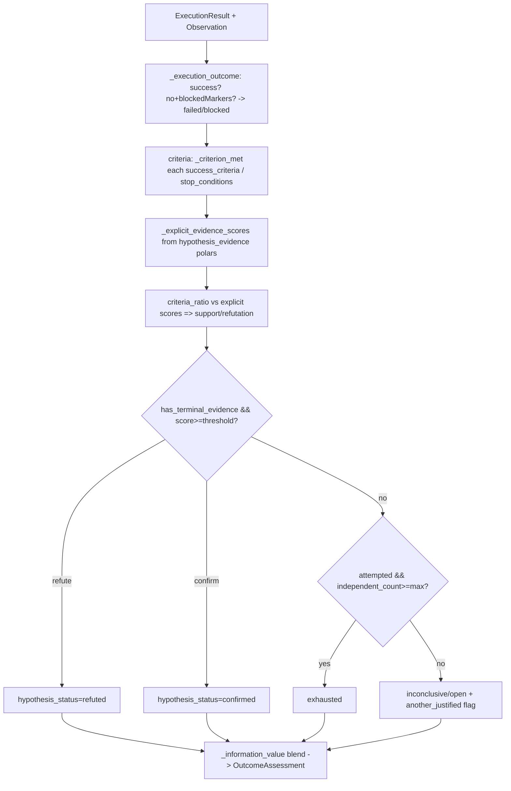

## Purpose

Separate “what the tool said” from “what it proves.” `ObserverAgent` turns raw tool output into structured `Observation` facts/signals/findings; `OutcomeJudge` + `HypothesisRepository` judge that structured evidence against the task’s `success_criteria`/`stop_conditions`, persist hypothesis state and `OutcomeAssessment`, and reject terminal or duplicate checks. A `succeeded` tool run is not proof until the judge says so.

## Source Files

| File | Lines | Role |
|------|-------|------|
| `observer.py` | 308 | `ObserverAgent`, `Observation`, heuristic parsers for nmap/http/cve/os/generic, `usefulness` scoring |
| `outcome_judge.py` | 1112 | `OutcomeJudge`, `HypothesisRepository`, `HypothesisState`/`OutcomeAssessment`, `build_hypothesis_key`/`build_check_fingerprint`, deterministic judgment |

## Responsibilities

### `observer.py`

- Provide `Observation` dataclass (`observer.py:26`): `task_id/target/tool_name/input_summary/output_summary/facts/new_{assets,endpoints,parameters,technologies,identities,objects}/interesting_signals/possible_findings/dead_ends/recommended_followup_tasks/memory_updates/graph_updates/evidence_refs/hypothesis_evidence/confidence/usefulness`.
- Dispatch `observe(task, raw_output, tool_name, prior_state?, evidence_refs?)` (`observer.py:102`) by tool family:
  - `nmap/scan` → port/proto/state/service, OS line (`observer.py:173` `_parse_nmap_output`)
  - `http/web/curl` → status, `Server`/`X-Powered-By`, endpoints, `.git/.env` signals (`observer.py:201` `_parse_http_output`)
  - `cve/vuln` → `CVE-\d{4}-\d…`, CVSS extraction → `possible_findings` when CVSS≥7 (`observer.py:236` `_parse_cve_output`)
  - `check_os/os` → WINDOWS/LINUX/inconclusive (`observer.py:257` `_parse_os_output`)
  - otherwise → line facts + dead_ends on `error/fail/timeout` vs `success/complete` (`observer.py:268` `_parse_generic_output`)
- Score `usefulness = min(len(facts)+2*endpoints+2*technologies+3*signals+5*findings,100)` (`observer.py:285`).
- Optionally embed the summarized observation via `SemanticMemoryManager.store_embedding` and set confidence via `tools/intelligence/adapters/observer_adapter.ObserverAdapter().infer_confidence` when refs exist.

### `outcome_judge.py`

- Define enums `ExecutionOutcome(succeeded/failed/blocked)` (`outcome_judge.py:21`), `HypothesisStatus(open/confirmed/refuted/inconclusive/exhausted)` (`outcome_judge.py:29`), `TERMINAL_HYPOTHESIS_STATUSES={confirmed,refuted,exhausted}`.
- Define `HypothesisState` (`outcome_judge.py:49`: `hypothesis_id/mission_id/statement/target/status/confidence/evidence_refs/attempt_count/independent_check_count/check_history/candidate_checks/last_information_value`, `is_terminal`, `check_fingerprints`, `to_dict`) and `OutcomeAssessment` (`outcome_judge.py:103`: `task_id/hypothesis_id/execution_outcome/hypothesis_status/confidence/satisfied/unsatisfied/stop/evidence_refs/reasoning/information_value/another_investigation_justified/check_fingerprint/independent_check/attempt_count`).
- Implement `OutcomeJudge(max_inconclusive_attempts=3, confirmation_threshold=0.75, refutation_threshold=0.75, min_evidence_references=1)` (`outcome_judge.py:163`) — validates thresholds. `judge(task, execution_result, observation, evidence_refs?, prior_hypothesis?)` (`outcome_judge.py:190`) computes: execution outcome from `success/error/scope_gate_passed` → satisfied/unsatisfied/triggered via `_criterion_met` (`outcome_judge.py:680`) → support/refutation from `hypothesis_evidence` polars + `facts` `confirms`/`refutes` prefixes → terminal if `len(refs)>=min` and score≥threshold else `INCONCLUSIVE`/`OPEN` → `information_value` blend (`outcome_judge.py:865`) → `another_investigation_justified = status ∈{open,inconclusive} && independent_count < max`.
- Own `HypothesisRepository(db, mission_id)` (`outcome_judge.py:310`) for persistence + guards: `ensure_for_task` (keyed by `hash(target+"\n"+hypothesis)`), `prepare_task` (raises `DuplicateInvestigationError`/`ClosedHypothesisError`, `outcome_judge.py:374`), `get`/`get_for_task`/`list_all`/`list_unresolved`, `persist_assessment` (atomic `outcome_assessments` insert + `hypotheses` update + `tasks` block sweep on terminal + audit log), `get_assessment_for_task`.
- Material-identity helpers: `build_hypothesis_key(statement,target)->sha256` (`outcome_judge.py:579`), `build_check_fingerprint(task)->sha256` (`outcome_judge.py:584`) over `{tool, tool_args}` or `{method/objective}` normalized.

## Public Interfaces

### `observer.py`

| Symbol | Location | Signature |
|--------|----------|-----------|
| `Observation` | `observer.py:26` | dataclass (fields above) + `to_dict()` |
| `ObserverAgent` | `observer.py:88` | `(semantic_memory=None)` |
| `ObserverAgent.observe` | `observer.py:102` | `(task, raw_output, tool_name?, prior_state?, evidence_refs?) -> Observation` |
| `ObserverAgent._parse_nmap_output` | `observer.py:173` | `(obs, output, target)` |
| `ObserverAgent._parse_http_output` | `observer.py:201` | `(obs, output, target)` |
| `ObserverAgent._parse_cve_output` | `observer.py:236` | `(obs, output, target)` |
| `ObserverAgent._parse_os_output` | `observer.py:257` | `(obs, output, target)` |
| `ObserverAgent._parse_generic_output` | `observer.py:268` | `(obs, output, target, tool_name)` |
| `ObserverAgent._score_usefulness` | `observer.py:285` | `(obs) -> int 0..100` |
| `_compact_output` | `observer.py:303` | `(raw, max_len=500) -> str` |

### `outcome_judge.py`

| Symbol | Location | Notes |
|--------|----------|-------|
| `ExecutionOutcome` | `outcome_judge.py:21` | Enum |
| `HypothesisStatus` | `outcome_judge.py:29` | Enum |
| `TERMINAL_HYPOTHESIS_STATUSES` | `outcome_judge.py:39` | `frozenset(3)` |
| `HypothesisState` | `outcome_judge.py:49` | Dataclass |
| `OutcomeAssessment` | `outcome_judge.py:103` | Dataclass, `evidential_outcome` maps `confirmed->success, refuted->failure` |
| `DuplicateInvestigationError` / `ClosedHypothesisError` | `outcome_judge.py:155` | `ValueError` subtypes |
| `OutcomeJudge` | `outcome_judge.py:163` | `(max_inconclusive_attempts>=2, confirmation/refutation 0.5..1.0, min_evidence_references>=1)` |
| `OutcomeJudge.judge` | `outcome_judge.py:190` | Pure function (no DB side effects) |
| `HypothesisRepository` | `outcome_judge.py:310` | Persistence + queue guards |
| `HypothesisRepository.ensure_for_task` | `outcome_judge.py:317` | `(task)->HypothesisState\|None` |
| `HypothesisRepository.prepare_task` | `outcome_judge.py:374` | `(task)->(state, fingerprint)` — throws on terminal/duplicate |
| `HypothesisRepository.persist_assessment` | `outcome_judge.py:428` | `(task, assessment)->(persisted, HypothesisState\|None)` |
| `build_hypothesis_key` / `build_check_fingerprint` | `outcome_judge.py:579` | Pure identity hashes |
| `_execution_outcome` / `_as_mapping` / `_criterion_met` / `_explicit_evidence_scores` | `outcome_judge.py:622` | Internals used by `judge` |

## Inputs/Outputs

| Input | Notes |
|-------|-------|
| `task` dict | `task_id`, `target`, `hypothesis`, `success_criteria`, `stop_conditions`, `allowed_tools`, `hypothesis_id` (when set) |
| `ExecutionResult` | `success`, `error`, `scope_gate_passed`/`risk_gate_passed`, `evidence_refs` |
| `Observation` | Structured `facts/new_endpoints/technologies/hypothesis_evidence/references`, **never raw words like “success”** (filtered via `_STOPWORDS`, `outcome_judge.py:925`) |
| `evidence_refs` | Union of all three sources via `_merge_refs` |

| Output | Notes |
|--------|-------|
| `Observation` | Prerequisite for `judge`; persisted via `agent_loop._save_observation` |
| `OutcomeAssessment` | `hypothesis_status`, `confidence`, `satisfied/unsatisfied/triggered`, `information_value`, `another_investigation_justified`, audit event |
| DB mutations | `hypotheses` (status/confidence/attempts/history), `outcome_assessments` (one per task), `tasks.block_reason` sweep on terminal, `audit_logs` entry |

Judgment sequence (`docs/runtime-flows.md`):

```
ExecutionResult(succeeded/failed/blocked) + Observation + criteria/stops + refs
 -> OutcomeAssessment (open/confirmed/refuted/inconclusive/exhausted)
 -> hypothesis state + operator event + audit + optional ExperienceStore lesson
 -> next planning cycle
```

Blocked checks do not consume an attempt; a failed command’s error never refutes (only explicit `contradicts`/`supports` claims do).

## State/Persistence

- `hypotheses` columns: `hypothesis_key` (UNIQUE per mission), `statement`, `target`, `status`, `confidence`, `evidence_refs_json`, `attempt_count`, `independent_check_count`, `check_history_json`, `candidate_checks_json`, `last_information_value`, timestamps.
- `outcome_assessments` columns: `mission_id`, `task_id UNIQUE`, `hypothesis_id`, `execution_outcome`, `hypothesis_status`, `confidence`, `satisfied/unsatisfied/triggered_json`, `evidence_refs_json`, `reasoning`, `information_value`, `another_investigation_justified`, `check_fingerprint`, `independent_check`, `attempt_count`.
- `check_history` entries carry `fingerprint`, `task_id`, `tool`, `objective`, `phase`, `risk_level`, `estimated_cost`, `success_criteria/stop_conditions`, `execution_outcome`, `hypothesis_status`.

## Configuration

- `mission_config.outcome_judgment`: `max_inconclusive_attempts` (≥2, default 3), `confirmation_threshold`/`refutation_threshold` (0.5..1.0, default 0.75), `min_evidence_references` (≥1, default 1) — surfaced in `agent_loop.__init__` via `outcome_judgment` dict.

## Dependencies

- `observer.py` → `re`, `dataclasses`; optional `tools.semantic_memory.SemanticMemoryManager`, `tools/intelligence/adapters/observer_adapter.ObserverAdapter`
- `outcome_judge.py` → `db.DatabaseManager`, `hashlib`, `json`, `re`, `enum`, `dataclasses`
- Consumers: `agent_loop.AgentLoop.run` (per-cycle), `cli.cmd_run_task` (single-step observe path)

## Used By

- `agent_loop.run` — observes every `ExecutionResult`, judges, persists, and emits `outcome_judgment` event.
- `task_queue.TaskQueue.create_task` — calls `HypothesisRepository.prepare_task` as the creation guard.

## Control Flow



Criterion matching (`_criterion_met`) supports both structured `{field, operator, value}` (operators: `exists/count_gte/gte/equals/not_equals/contains/not_contains`) and free-text clauses (token-overlap heuristic with stopword filter).

## Failure Modes

| Failure | Handling |
|---------|----------|
| `Terminal` hypothesis replanned | `HypothesisRepository.prepare_task` raises `ClosedHypothesisError`; `AgentLoop` emits `task_rejected` |
| Duplicate `tool+args` fingerprint | `DuplicateInvestigationError` (both in-queue and history check) |
| No `evidence_refs` and `min_evidence_references` not met | Terminal judgment withheld; status stays `inconclusive`/`open` with “not enough persisted evidence” reasoning |
| Generic tokens like `success` as criterion | `_STOPWORDS` + `contains` guard prevents vacuous confirmation |

## Invariants

- Raw words `success`/`completed` never confirm; only `hypothesis_evidence` polars or satisfied `success_criteria` count.
- `Operation_outcome` (tool success) and `Hypothesis_status` are independent; task status mirrors operation outcome only.
- `another_investigation_justified` is true only for `open/inconclusive` with `independent_count < max`.
- `ExecutionOutcome.BLOCKED` never appends to `check_history` (`outcome_judge.py:453` guard).

## Security Boundaries

- Observer is not a vulnerability oracle — `possible_findings` is advisory; only `FindingVerifier` may validate.
- Evidence references are required for terminal; zombie “success” without persisted evidence is `inconclusive`.

## Tests

| Test file | Covers |
|-----------|--------|
| `tests/test_observer.py` | Parser branches (nmap/http/cve/os/generic), `usefulness`, evidence ref pass-through |
| `tests/test_outcome_judge.py` | `judge` truth table, terminal/duplicate guards, threshold validation, `persist_assessment` atomic sweep |
| `tests/test_outcome_judge_flow_a.py` | Flow A bridge semantics |
| `tests/test_learning_loop.py` | `evidential_outcome` → `ExperienceStore` mapping (only success/failure mapped) |
| `tests/test_summarizer.py` | `summarize_observation` one-liner |

Run: `python -m pytest tests/test_outcome_judge.py tests/test_observer.py -v`

## Common Changes

| Change | Where |
|--------|-------|
| Add observer parser | `observer.py:136` `observe` dispatch + new `_parse_*` static |
| Change scoring/explicit polars | `outcome_judge.py:789` `_explicit_evidence_scores`, `observer.py:285` `_score_usefulness` |
| Tune thresholds | `agent_loop.py:203` outcome_judgment dict → `OutcomeJudge.__init__` |
| Extend criterion operators | `outcome_judge.py:690` `_structured_criterion_met` |

## Update This Document When

- `Observation` fields, parser set, or `usefulness` formula change.
- `HypothesisStatus` / `ExecutionOutcome` values, `TERMINAL_HYPOTHESIS_STATUSES`, or thresholds change.
- `build_hypothesis_key` / `build_check_fingerprint` hashing payload changes.
- `HypothesisRepository` guard or `persist_assessment` sweep semantics change.

## Related Documentation

- `docs/runtime-flows.md` §Judgment Sequence / §Hypothesis and Outcome Boundary
- `docs/outcome-evidence.md` — evidence grounding in prose
- `executor.py` / `tool_router.py` (`docs/components/flow-b/executor-router.md`) — produces `ExecutionResult`
- `planner.py` / `task_queue.py` (`docs/components/flow-b/planner-queue.md`) — consumes hypothesis state
- `evidence.py` / `memory.py` / `target_graph.py` (`docs/components/flow-b/evidence-memory-graph.md`) — downstream stores
