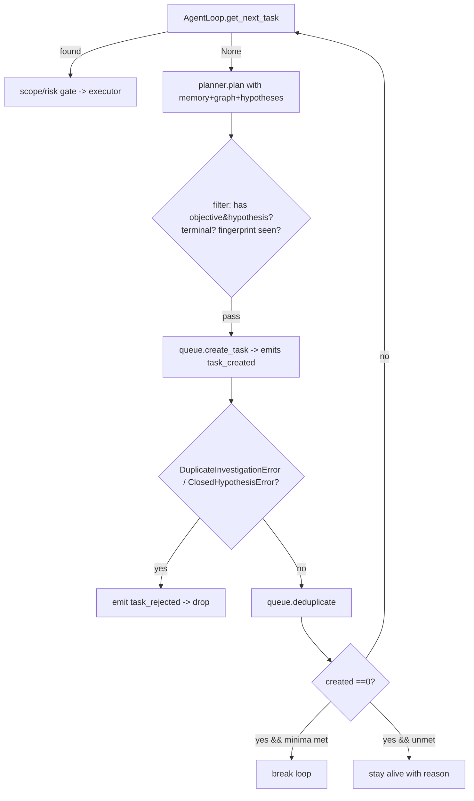

## Purpose

Produce and persist the next concrete, scoped research tasks. `PlannerAgent` creates task dicts from mission + memory/graph + open hypotheses; `TaskQueue` stores them in SQLite, scores priority, enforces phase/status lifecycle, deduplicates, and hands the next pending task to the loop under hypothesis-terminal and duplicate-fingerprint constraints.

## Source Files

| File | Lines | Role |
|------|-------|------|
| `planner.py` | 505 | `PlannerAgent`: planning phases, service→attack map, `plan` + `plan_retry_with_modifications` + `rank_unresolved_hypotheses` |
| `task_queue.py` | 448 | `TaskQueue`: CRUD, phase normalization, `_score_priority`, `deduplicate`, `reprioritize`, stale-reset |

## Responsibilities

### `planner.py`

- Hold static planning phases (`_PLANNING_PHASES`, 13 entries from `scope_confirmation`→`report_generation`, `planner.py:39`) and service→attack module map (`_SERVICE_ATTACK_MAP`, `planner.py:57`) covering `ssh`/`smb`/`http`/`ftp`/`rdp`/`redis`/… with `module/tools/risk/priority`.
- Offer `plan_retry_with_modifications(failed_task, error, attempt, hypothesis_state)` (`planner.py:123`): returns `None` for permanent errors or terminal hypotheses; otherwise rotates `allowed_tools` (→ `alternative-tool:`), doubles `timeout_seconds` on timeout, lowers priority by 5, tags `investigation_method`, and ensures fingerprint changes.
- Offer `plan(mission, target_summary, graph_summary, open_hypotheses?, hypothesis_states?, existing_task_count, phase_filter, max_tasks)` (`planner.py:191`): emits up to `max_tasks` (default 5) tasks across 5 buckets (scope confirmation when `existing_count==0` → asset discovery → service identification → web/api mapping → per-hypothesis independent `tool` checks that avoid prior fingerprints) with filtering on `objective`/`hypothesis` presence, terminal-status exclusion, and seen `(key,fingerprint)` guard.
- Rank hypotheses (`planner.py:388` `rank_unresolved_hypotheses`) by `45 + 20*uncertainty + 20*information_value + 10*confidence − 8*attempts − risk_penalty − 10*cost` (risk_penalty: low 0, medium 10, high 25).

### `task_queue.py`

- Define `VALID_TASK_PHASES` (`recon/analysis/test/validate/exploit/post_exploit/report`, `task_queue.py:21`) and `_TASK_PHASE_ALIASES` for legacy strings (`task_queue.py:31`).
- Persist tasks via `create_task(task_data)` (`task_queue.py:55`): calls `HypothesisRepository.prepare_task` for identity → validates phase/risk/status → computes `_score_priority` if priority is 0 → inserts `tasks` row with `hypothesis_id`/`check_fingerprint`.
- Serve `get_next_task(target="")` (`task_queue.py:119`): `LEFT JOIN hypotheses WHERE tasks.status='pending' AND (h.id IS NULL OR h.status IN ('open','inconclusive')) ORDER BY priority DESC, created_at ASC` — thereby never handing a terminal-hypothesis task.
- Support `update_task_status`/`complete_task`/`block_task` (`task_queue.py:141`), `reset_stale_running()` (`task_queue.py:181` requeues `running→pending` on resume), `get_task`, `list_open_tasks`/`list_blocked_tasks`/`list_completed_tasks` (`task_queue.py:216`), `deduplicate` (deletes `pending` dup on `target/objective/phase` keeping lowest id, `task_queue.py:269`), `reprioritize` (rescues all `pending` via `_score_priority`), `count_by_status`/`count_total`.

## Public Interfaces

### `planner.py`

| Symbol | Location | Notes |
|--------|----------|-------|
| `_PLANNING_PHASES` | `planner.py:39` | 13 ordered phase names |
| `_SERVICE_ATTACK_MAP` | `planner.py:57` | `dict[str, list[{module, tools, risk, priority}]]` for 12+ services |
| `PlannerAgent` | `planner.py:114` | `(risk_profile="low_noise_non_destructive")` |
| `PlannerAgent.plan_retry_with_modifications` | `planner.py:123` | `(failed_task, error, attempt, hypothesis_state?) -> dict\|None` |
| `PlannerAgent.plan` | `planner.py:191` | `(mission, target_summary="", graph_summary="", open_hypotheses?, hypothesis_states?, existing_task_count=0, phase_filter="", max_tasks=5) -> list[dict]` |
| `PlannerAgent.rank_unresolved_hypotheses` | `planner.py:388` | `static (hypotheses) -> list[dict]` with `planning_score` |
| `PlannerAgent._create_task` | `planner.py:434` | `(phase,target,asset_type,objective,hypothesis,allowed_tools,risk_level,priority,success_criteria?,...) -> dict` |
| `_primary_mission_target` | `planner.py:471` | `(mission) -> str` (first allowed/target asset or `target`/`program_name`) |
| `_state_dict` | `planner.py:484` | `(value) -> dict` |
| `_unit_float` | `planner.py:501` | `(value,default) -> float` clamped 0..1 |

### `task_queue.py`

| Symbol | Location | Notes |
|--------|----------|-------|
| `VALID_TASK_PHASES` | `task_queue.py:21` | `frozenset` |
| `_TASK_PHASE_ALIASES` | `task_queue.py:31` | Legacy → canonical |
| `TaskQueue` | `task_queue.py:45` | `(db, mission_id)` (also creates `HypothesisRepository`) |
| `TaskQueue.create_task` | `task_queue.py:55` | `(task_data) -> str task_id` — may raise `DuplicateInvestigationError` / `ClosedHypothesisError` |
| `TaskQueue.get_next_task` | `task_queue.py:119` | `(target="") -> dict\|None` |
| `TaskQueue.update_task_status` | `task_queue.py:141` | `(task_id, status in pending/running/blocked/complete/failed/needs_approval, result_summary="", evidence_refs?)` |
| `TaskQueue.complete_task` | `task_queue.py:166` | `(task_id, result_summary="", evidence_refs?)` — sugar for `complete` |
| `TaskQueue.block_task` | `task_queue.py:174` | `(task_id, reason)` — sets `block_reason` |
| `TaskQueue.reset_stale_running` | `task_queue.py:181` | `() -> int` — safety-critical resume primitive |
| `TaskQueue.get_task` | `task_queue.py:203` | `(task_id) -> dict\|None` |
| `TaskQueue.list_open_tasks` | `task_queue.py:216` | `(target?, status?, phase?, search?) -> list` (default pending/running; status filter overrides) |
| `TaskQueue.list_blocked_tasks` / `list_completed_tasks` | `task_queue.py:247` | `(target?) -> list` |
| `TaskQueue.deduplicate` | `task_queue.py:269` | `() -> int removed` |
| `TaskQueue.reprioritize` | `task_queue.py:285` | `() -> None` |
| `TaskQueue._score_priority` | `task_queue.py:305` | `static (task) -> int 0..100` |
| `TaskQueue.count_by_status` / `count_total` | `task_queue.py:384` | `() -> dict / int` |
| `_row_to_task` | `task_queue.py:404` | `(data) -> dict` (json-loads `_json` columns) |
| `_normalize_task_phase` | `task_queue.py:431` | `(phase) -> str canonical` |
| `_json_load` | `task_queue.py:438` | `(raw, default) -> Any` |

## Inputs/Outputs

| Input | Notes |
|-------|-------|
| `mission` dict | `allowed_assets`, `program_name`, `mission_id` |
| `target_summary` / `graph_summary` | From `MemoryManager`/`TargetGraph` text summaries |
| `hypothesis_states` | From `HypothesisRepository.list_all()` (planner consumes open+terminal for filtering) |
| `task_data` | Must include `objective`, `hypothesis`, `allowed_tools`, `phase`, `target`, optional `success_criteria/stop_conditions` |

| Output | Notes |
|--------|-------|
| `task dict` | Written to `tasks` with `id, mission_id, phase, target, objective, hypothesis, allowed_tools_json, risk_level, priority, success_criteria_json, hypothesis_id, check_fingerprint, status=pending` |
| `get_next_task` | `None` when no pending non-terminal tasks |

## State/Persistence

- `tasks` columns: `phase`, `target`, `asset_type`, `objective`, `hypothesis`, `preconditions_json`, `allowed_tools_json`, `risk_level`, `priority`, `required_human_approval`, `success_criteria_json`, `stop_conditions_json`, `status ∈(pending,running,blocked,complete,failed,needs_approval)`, `result_summary`, `block_reason`, `evidence_refs_json`, `hypothesis_id`, `check_fingerprint`, `created_at`, `updated_at`.
- Indexes: `idx_tasks_mission`, `idx_tasks_status(status,priority)`, `idx_tasks_target`, `idx_tasks_hypothesis(mission_id,hypothesis_id,check_fingerprint)`.
- Priority `0..100` scored on insertion and on `reprioritize()`:
  - Phase bonus: `exploit 30` > `validate 25` > `test 20` > `analysis 10` > `recon 5`.
  - Bonus on `objective+hypothesis` text: `auth/bypass/privilege` +10, `idor/object` +10, `sensitive/data/leak` +10, has `hypothesis` +5, `confidence*10`, `expected_information_value*20`.
  - Penalty: `attempts*5`, `estimated_cost*10`, `risk high −10`/`medium −3`, vague `discover/scan` without hypothesis −5, `scan all` −5.
- Dedup is predicate `target+objective+phase` duplicate (`pending` only, keeps lowest id).
- `check_fingerprint` + `hypothesis_id` come from `outcome_judge.build_check_fingerprint / build_hypothesis_key` via `prepare_task`.

## Configuration

- `PlannerAgent.risk_profile` — currently stored, not yet branching phase creation (reserved).
- `TaskQueue` reads no `config.yaml` — behavior driven by caller-provided `task_data`.
- `VALID_TASK_PHASES` vs legacy aliases: unknown phases fall through to `"test"` (`_normalize_task_phase`).

## Dependencies

- `planner.py` → `outcome_judge.build_check_fingerprint`, `build_hypothesis_key`, `TERMINAL_HYPOTHESIS_STATUSES`, `HypothesisStatus`
- `task_queue.py` → `db.DatabaseManager`, `outcome_judge.HypothesisRepository`, `_new_id`, `_now_iso`
- Callers: `agent_loop.AgentLoop` (primary), `cli.cmd_next_task/cmd_list_tasks/cmd_run_task`

## Used By

- `agent_loop.run`: `planner.plan` + `queue.create_task` inside the “no pending tasks” branch; `queue.get_next_task` at top of every cycle; `queue.reprioritize` tail of cycle; `planner.plan_retry_with_modifications` on failed operational errors.
- `cli.py`: `next-task`, `list-tasks`, `run-task [id]`.

## Control Flow

## Failure Modes

| Failure | Handling |
|---------|----------|
| `DuplicateInvestigationError` (fingerprint already queued/attempted) | Caught in `agent_loop.py:556`/`677`/`877`; emits `task_rejected`; task not created |
| `ClosedHypothesisError` (terminal hypothesis) | Same as above; planner also pre-filters terminal via `rank_unresolved_hypotheses` |
| Empty `allowed_tools` | `ExecutorAgent.execute` returns failure; loop marks `failed` + `mark_dead_end`, judge remains inconclusive |
| `plan_retry_with_modifications` returns `None` | No retry created (permanent error or same fingerprint) |
| Priority `0` fallback | Computed via `_score_priority` heuristics |

## Invariants

- `get_next_task` never returns a task whose hypothesis is `confirmed`/`refuted`/`exhausted`.
- `create_task` is the sole writer of `check_fingerprint`; it always matches `build_check_fingerprint(task_data)`.
- `planner.plan` never mutates DB — only returns dicts; `Queue` is the only persistence.
- `reprioritize` only touches `status='pending'` rows.
- `reset_stale_running` only transitions `running` → `pending`.

## Security Boundaries

- No direct execution — planner/queue only produce and store task dicts; scope/risk gates are applied at execution time (next layer).
- `hypothesis_id`/`check_fingerprint` prevent unbounded retry loops on inconclusive hypotheses (`max_inconclusive_attempts` enforced in `OutcomeJudge`).

## Tests

| Test file | Covers |
|-----------|--------|
| `tests/test_task_queue.py` | `create_task` → `get_next_task` ordering, priority, dedup, stale reset, blocked listing, `_score_priority` |
| `tests/test_agent_loop.py` | Planner-queue integration: plan on empty, dedup, retry, phase minima gate |
| `tests/test_outcome_judge.py` | Fingerprint/key identity used by queue guards |

Run: `python -m pytest tests/test_task_queue.py tests/test_agent_loop.py -v`

## Common Changes

| Change | Where |
|--------|-------|
| Add a planning phase | `planner.py:39` `_PLANNING_PHASES` + `planner.plan` new `if not phase_filter or phase_filter == ...` bucket |
| Add service→module suggestions | `planner.py:57` `_SERVICE_ATTACK_MAP` |
| Tweak ranking | `planner.py:388` `rank_unresolved_hypotheses` weights |
| Adjust priority weights | `task_queue.py:305` `_score_priority` |
| Add legacy phase alias | `task_queue.py:31` `_TASK_PHASE_ALIASES` |

## Update This Document When

- `PlannerAgent.plan` buckets, `plan_retry_with_modifications` permanent-error list, or ranking formula change.
- `TaskQueue` schema (`tasks` phases/statuses, `check_fingerprint` handling) or `_score_priority` weights change.
- `deduplicate` / `reprioritize` / `reset_stale_running` semantics change.

## Related Documentation

- `docs/runtime-flows.md` §Database-Backed Research Loop — planning ordering
- `agent_loop.py` (`docs/components/flow-b/agent-loop.md`) — consumer loop
- `outcome_judge.py` (`docs/components/flow-b/observer-outcome.md`) — hypothesis identity + fingerprint source
- `tools/attack_modules/` (`docs/attack-modules.md`) — service modules that planner indirectly references via `_SERVICE_ATTACK_MAP`
