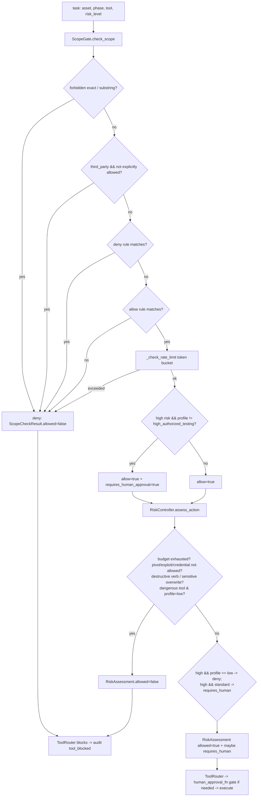

## Purpose

Two-layer safety for every Flow B tool action. `ScopeGate` answers **what** may be touched (allow/deny asset rules, forbidden actions, third-party detection, rate limits). `RiskController` answers **how** it may be touched (destructive-pattern deny, dangerous-tool deny, action-category permission, task/command budgets, human-approval flag). Every `ToolRouter.route` and every `AgentLoop` cycle passes through both; `cli run-task` re-implements the same two-call sequence.

Per `docs/safety-model.md`, Flow B safety depends on these files — they are frozen (no feature edits).

## Source Files

| File | Lines | Role |
|------|-------|------|
| `scope_gate.py` | 504 | `ScopeGate`, `ScopeCheckResult`, `_RateBucket`, rule engine, third-party/rate-limit helpers |
| `risk_controller.py` | 298 | `RiskController`, `RiskAssessment`, destructive/dangerous patterns, budget counters |

Shared by Flow A only for the Path-B no-MCP Orchestrator branch (`tools/autonomous_orchestrator.AttackModuleExecutor.scope_gate.check_scope`) as its target-lock.

## Responsibilities

### `scope_gate.py`

- Hold `allowed_assets`/`disallowed_assets` as in-memory rule lists + `forbidden_actions` (unioned with `_HARD_FORBIDDEN_ACTIONS` deny-of-service/malware/social/physical etc., `scope_gate.py:33`) and `rate_limits`/`_default_rps` (`scope_gate.py:99`).
- Reload from DB (`scope_gate.py:146` `load_from_db`: `get_scope_rules` → separates `allow` vs `deny`/`action`).
- Evaluate `check_scope(asset, action_type, tool_name, risk_level, enforce_rate_limit)` (`scope_gate.py:165`) in order: 1) `action_type` exact forbidden match, 2) hard-substring deny, 3) third-party auto-reject if not explicitly allowed, 4) deny-rules, 5) allow-rules (required), 6) sliding-window rate limit (`scope_gate.py:295`), 7) high-risk → sets `requires_human_approval` when `risk_profile != "high_authorized_testing"`.
- Provide rule engine: `_rule_matches` (domain exact, wildcard `*.`, ip, cidr `subnet_of`, url_prefix via `_url_prefix_matches`), `_classify_target_type` (recognizes `http(s)://` as `url_prefix`), `_is_third_party_asset` (anchored regex + explicit cdn checks), `_clean_asset` (IPv6-safe, CIDR-preserving, host-only — never used for URL rules).
- URL-prefix scope (`_canonicalize_url` / `_url_prefix_matches`): rules keep scheme + hostname (case-insensitive) + normalized port (default 80/443 folded away) + path, parsed with `urllib.parse` — never string splitting. Path comparison is directory-boundary safe (`/admin` authorizes `/admin` and `/admin/...`, never `/administrator`); query/fragment are ignored; malformed URLs fail closed. `check_scope` matches `url_prefix` rules against the raw asset while host rules keep using the normalized host, so host-level scope is unaffected.
- Rate bucket: token-bucket `_RateBucket` (tokens refill at the configured RPS up to `max(1, rate)` burst; fractional rates honored, monotonic clock, never sleeps; denials report `retry_after_seconds`).

### `risk_controller.py`

- Enforce per-session budgets: `max_commands` (tool executions) + `max_tasks` (completions) (`risk_controller.py:97`); `can_proceed` checks `commands < max`; `assess_action` denies when either budget exhausted before any other check (`risk_controller.py:145`).
- Gate action categories (H19, `risk_controller.py:158`): `exploit`/`test_exploit` requires `allow_exploitation`; `pivot`/`lateral` requires `allow_pivoting`; `credential`/`cred_test` requires `allow_credential_testing`.
- Block destructive commands unconditionally via word-boundary regexes (`risk_controller.py:35` `_DESTRUCTIVE_PATTERNS`: `rm`, `dd`, `kill*`, `shred`, `mkfs`, `chmod 777`, `-drop`, `delete`, `truncate` etc., with whitespace/`;|&` normalization) and sensitive-path overwrites via redirect/tee (`risk_controller.py:64` `_SENSITIVE_OVERWRITE_PATTERNS`).
- Block dangerous exploit tools (`risk_controller.py:71` `DANGEROUS_TOOL_PATTERNS`: `hydra`, `msfconsole`, `exploit/windows/`, `mimikatz`, `psexec`, `kerberoast`, etc.) when `allow_exploitation` false.
- Gate `high` risk by profile: `low_noise_non_destructive` → deny; `standard_authorized` → allow but `requires_human_approval=True`; `high_authorized_testing` → no extra gate (`risk_controller.py:255`).
- Track `record_execution` / `record_task_complete` / `budgets()` (`risk_controller.py:282`).

## Public Interfaces

### `scope_gate.py`

| Symbol | Location | Notes |
|--------|----------|-------|
| `_HARD_FORBIDDEN_ACTIONS` | `scope_gate.py:33` | `frozenset(6)` hard-blocked action types |
| `_THIRD_PARTY_DOMAINS` / `_THIRD_PARTY_PATTERN` | `scope_gate.py:44` | Heuristic infra detection |
| `ScopeCheckResult` | `scope_gate.py:61` | `allowed, reason, matched_scope_rule, risk_level, requires_human_approval, is_third_party, rate_limit_remaining` |
| `_RateBucket` | `scope_gate.py:76` | `timestamps: deque, max_per_second: float` |
| `ScopeGate` | `scope_gate.py:88` | `(db, mission_id, allowed_assets?, disallowed_assets?, forbidden_actions?, rate_limits?, risk_profile?, default_rps?)` |
| `ScopeGate.load_from_db` | `scope_gate.py:146` | Reload from `scope_rules` |
| `ScopeGate.check_scope` | `scope_gate.py:165` | `asset, action_type, tool_name, risk_level, enforce_rate_limit -> ScopeCheckResult` — primary safety API |
| `ScopeGate._check_rate_limit` | `scope_gate.py:295` | `(asset, action_type) -> ScopeCheckResult` |
| `ScopeGate.list_scope` | `scope_gate.py:329` | `-> {allow:[], deny:[], forbidden_actions:[]}` |
| `ScopeGate.list_forbidden_actions` | `scope_gate.py:336` | `-> list[str]` |
| `ScopeGate.is_asset_in_scope` | `scope_gate.py:339` | `(asset) -> bool` (calls `check_scope` with `recon/low`, no rate limit) |
| `_rule_matches` | `scope_gate.py:346` | `(rule, asset) -> bool` |
| `_matches_allow_rules` | `scope_gate.py:403` | `(asset, allow_rules) -> bool` |
| `_classify_target_type` | `scope_gate.py:416` | `(asset) -> domain|ip|cidr|wildcard_domain` |
| `_is_third_party_asset` | `scope_gate.py:436` | `(asset) -> bool` |
| `_clean_asset` | `scope_gate.py:455` | `(asset) -> str` — strips proto/path/port, CIDR/IPv6-safe |

### `risk_controller.py`

| Symbol | Location | Notes |
|--------|----------|-------|
| `DESTRUCTIVE_KEYWORDS` | `risk_controller.py:24` | Legacy frozenset (matching now via regexes) |
| `_DESTRUCTIVE_PATTERNS` | `risk_controller.py:35` | 13 word-boundary regexes |
| `_SENSITIVE_OVERWRITE_PATTERNS` | `risk_controller.py:64` | 2 redirect/tee regexes into `_SENSITIVE_SYSTEM_DIRS` |
| `DANGEROUS_TOOL_PATTERNS` | `risk_controller.py:71` | `frozenset` of exploit-creds/payload keywords |
| `RiskAssessment` | `risk_controller.py:83` | `allowed, risk_level, reason, requires_human_approval, warnings, mitigation_suggestions` |
| `RiskController` | `risk_controller.py:94` | `(risk_profile, max_commands=100, max_tasks=20, allow_exploitation?, allow_pivoting?, allow_credential_testing?)` |
| `RiskController.assess_action` | `risk_controller.py:118` | `(action_type, tool_name, command_or_args, target="", risk_level="low") -> RiskAssessment` — **not additive**: ANY destructive/password pattern denies immediately regardless of profile |
| `RiskController.record_execution` / `record_task_complete` | `risk_controller.py:282` | Increment counters |
| `RiskController.budgets` | `risk_controller.py:288` | `{commands_executed/max/remaining, tasks_completed/max}` |
| `RiskController.can_proceed` | `risk_controller.py:297` | `commands_executed < max_commands` |

## Inputs/Outputs

| Input | Notes |
|-------|-------|
| `asset` | Domain/IP/CIDR/URL; cleaned via `_clean_asset` |
| `action_type` | Planner phase string (`recon`/`test`/`exploit`/…); **never** free-form LLM input |
| `tool_name` + `command_or_args` | Destructive/dangerous substring scan |
| `risk_level` | `low`/`medium`/`high` |
| Config | `risk_profile`, `max_commands_per_session`, `max_tasks_active`, `allows_exploitation/pivoting/credential_testing`, `rate_limits`, `default_rate_limit_rps` |

| Output | Notes |
|--------|-------|
| `ScopeCheckResult.allowed` / `RiskAssessment.allowed` | Both must be true to execute |
| `requires_human_approval` | When true + `human_approval_fn` absent → block; when handler present → ask operator |
| `reason` / `blocked_reason` | Audit/log strings |

## State/Persistence

- `ScopeGate` caches `_allow_rules`, `_deny_rules`, `_forbidden_action_strs` in memory; refreshed via `load_from_db()`. Rate buckets `_rate_buckets: dict[str,_RateBucket]` keyed by `f"{asset}:{action_type[:20]}"` are process-local token buckets (refilled by `time.monotonic`, capped at 10k entries with stalest-evicted).
- `RiskController` holds `_commands_executed` / `_tasks_completed` counters in memory (incremented by `ToolRouter` after each successful execution and by `AgentLoop` after each `complete`).
- No DB writes here except indirect audit via `ToolRouter._log_block` on deny.

## Configuration

| Source | Key | Used |
|--------|-----|------|
| `Mission.risk_profile` | `low_noise_non_destructive` / `standard_authorized` / `high_authorized_testing` | Both: high-risk approval + dangerous-tool flag |
| `Mission.max_commands_per_session` | | `RiskController._max_commands` |
| `Mission.max_tasks_active` | | `RiskController._max_tasks` |
| `Mission.allows_exploitation/pivoting` | From `_RISK_PROFILES` | `RiskController` booleans; also checked in `assess_action` category gates |
| `Mission.default_rate_limit_rps` | | `ScopeGate._default_rps` (falls back to `rate_limits.default_requests_per_second` or `2.0`) |
| `mission.yaml forbid*` + `scope_rules.type=action` | | `ScopeGate._forbidden_action_strs` |

## Dependencies

- `scope_gate.py` → `db.DatabaseManager`, `ipaddress`, `re`, `collections.deque`, `time`, `dataclasses`
- `risk_controller.py` → `re`, `dataclasses`
- Callers: `tool_router.ToolRouter`, `agent_loop.AgentLoop`, `cli.cmd_run_task`, `tools/autonomous_orchestrator.AttackModuleExecutor` (target-lock only)

## Used By

- `ToolRouter.route` (scope check step 1, risk step 2, then human-approval gate)
- `AgentLoop.run` (pre-executor scope/risk gates mirroring `ToolRouter` ordering; also used by `get_next_task` filter)
- `cli.cmd_run_task` (same two gates + `requires_human_approval` bail)

## Control Flow

## Failure Modes

| Mode | ScopeGate | RiskController |
|------|-----------|----------------|
| High-risk gated | `allowed=True, requires_human_approval=True` must not be treated as green light (`tool_router:149`, `cli:338`, `agent:634`) | `standard_authorized` sets `requires_human=True`; `low_noise` denies high outright |
| Destructive command (`rm -rf`, `mkfs`, `shred`, `> /etc/passwd`) | Not checked | Always denied, even with `high_authorized_testing` — “verifies, does not destroy” |
| Budget | Not checked | Denied with `Task budget exhausted` / `Command budget exhausted` |
| Rate burst | Sliding window prevents boundary double-spike | Not applicable |
| CIDR asset `10.0.0.0/16` vs allow `10.0.0.0/24` | `_rule_matches` with `subnet_of` rejects (over-broad subnet does NOT escape) | — |
| Bare IPv6 `[2001:db8::1]:443` | `_clean_asset` un-brackets, strips port | — |

## Invariants

- `check_scope` → deny always wins over allow; allow-miss is deny.
- `check_scope` with `allowed=True` **and** `requires_human_approval=True` is NOT a green light; caller must gate on explicit human `ALLOW`.
- `RiskController.assess_action` destructive check normalizes `[\s;|&]+` → spaces and word-boundary matches so `rm\t-rf` / `rm;-rf` still blocks.
- `ScopeGate._HARD_FORBIDDEN_SUBSTRINGS` intentionally excludes legitimate phases (`exploit`, `report`) to avoid disabling the planner's own outputs.
- Rate buckets honor fractional RPS (0.1/s accrues one token per 10s); non-positive rates clamp to the 1/s legacy floor.

## Security Boundaries

- These are the **only** Flow B authorization surfaces; removing either collapses safety. Must remain untouched for Flow A feature work (AGENTS.md §2).
- `risk_controller._DESTRUCTIVE_PATTERNS` + `_SENSITIVE_OVERWRITE_PATTERNS` are load-bearing defense-in-depth even on `high_authorized_testing` — they are not relaxed by profile.
- Flow A attack mode's single safety is the **target-IP allowlist lock** (`tools/mcp_shared._allowed_target_list` + `tools/mcp_tools/terminal._target_lock_block`), not these gates.

## Tests

| Test file | Covers |
|-----------|--------|
| `tests/test_scope_gate.py` | Allow/deny, wildcard/CIDR/subnet_of, forbidden actions, third-party, rate limit, high-risk approval, `_clean_asset` IPv6/CIDR |
| `tests/test_risk_controller.py` | Budgets, destructive/overwrite deny, exploit/pivot/credential gates, tool-pattern gating, high-risk profile branching |
| `tests/test_rate_limiter.py` | Sliding-window semantics, burst at boundary |
| `tests/test_tool_router_approval.py` | `requires_human_approval` propagation + empty-handler block |
| `tests/test_exploit_scope_gate.py` | Flow A vs Flow B scope-type regression |

Run: `python -m pytest tests/test_scope_gate.py tests/test_risk_controller.py -v -k scope`

## Common Changes

| Change | Where |
|--------|-------|
| Add a hard-forbidden action | `scope_gate.py:33` `_HARD_FORBIDDEN_ACTIONS` + `scope_gate.py:218` `_HARD_FORBIDDEN_SUBSTRINGS` (keep phase names out) |
| Add a destructive verb | `risk_controller.py:35` `_DESTRUCTIVE_PATTERNS` |
| Tune budgets / profile gates | `mission._RISK_PROFILES` + `risk_controller.__init__` wiring |
| Adjust rate limits | `scope_gate._RateBucket` / `_check_rate_limit` + `Mission.default_rate_limit_rps` |

## Update This Document When

- `_HARD_FORBIDDEN_ACTIONS`, `_DESTRUCTIVE_PATTERNS`, `DANGEROUS_TOOL_PATTERNS`, third-party heuristics, or `_clean_asset` handling changes.
- `check_scope` ordering or `requires_human_approval` semantics change.
- Budget or profile permission semantics change.

## Related Documentation

- `docs/safety-model.md` — safety controls in prose
- `docs/runtime-flows.md` §Database-Backed Research Loop — gate ordering
- `db.py` / `mission.py` (`docs/components/flow-b/db-mission.md`) — profile source + schema
- `tool_router.py` / `executor.py` (`docs/components/flow-b/executor-router.md`) — enforcement point
- `agent_loop.py` (`docs/components/flow-b/agent-loop.md`) — caller loop
