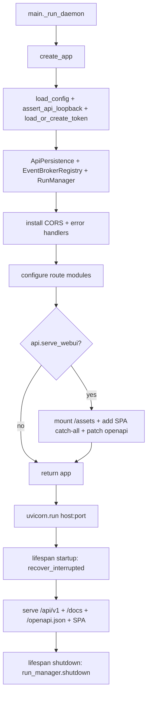

## Purpose

Creates the FastAPI ASGI app served by `main._run_daemon` (`--daemon` (legacy alias: `--demon`)/`--web`). Wires bearer auth, persistence, event broker, run manager, routers, CORS, error handlers, lifespan, and optional bundled WebUI SPA. Stays thin — all orchestration lives in `tools/api/` and `tools/run_service/`.

## Source Files

| File | Lines | Role |
|------|-------|------|
| `app.py` | 233 | `create_app` factory; lifespan, middleware, router wiring, SPA fallback |

## Responsibilities

- Build a `FastAPI(title="BreachPilot WebUI API")` with `lifespan` that calls `persistence.recover_interrupted()` on startup and `run_manager.shutdown()` on shutdown (`app.py:98`).
- Load/generate bearer token via `tools/api/auth.load_or_create_token` (`app.py:73`), enforce loopback host (`app.py:70` `assert_api_loopback`), create `BearerAuth`.
- Create `ApiPersistence(reports_dir)` and `EventBrokerRegistry(reports_dir, buffer_size)` (`app.py:81`, `app.py:88`).
- Create `RunManager(persistence, event_registry, config, config_path, callables)` (`app.py:91`).
- Configure CORS (loopback-only + `api.allowed_origins` validated via `is_loopback_origin`) and install error/middleware (`app.py:120`, `app.py:129`).
- Configure route modules: `system`, `runs`, `decisions`, `events`, `graph`, `graph_explorer`, optionally `users` when `api.multi_operator` (`app.py:133`).
- Optionally serve `webui/dist/` SPA at `/` when `api.serve_webui` true (`app.py:162`): mount `/assets`, add `/{full_path:path}` catch-all returning `index.html` with traversal guard, patch `app.openapi` to hide webui routes.

## Public Interfaces

| Symbol | Location | Signature | Description |
|--------|----------|-----------|-------------|
| `create_app` | `app.py:42` | `(config_path=Path("config.yaml"), callables=None, config=None) -> FastAPI` | Factory; when `config` provided, replaces on-disk load (used by `--web` in-memory override). Validates `api.allowed_origins`, `event_buffer_size`. |

No other public symbols — `app.py` is import-only via `main._run_daemon` / tests.

### Route modules configured (not defined here)

| Module | Factory call | Prefix |
|--------|--------------|--------|
| `tools.api.routes.system` | `system_routes.configure(auth, config, config_path)` + `configure_run_manager` | `/api/v1/system/*` |
| `tools.api.routes.runs` | `runs_routes.configure(auth, persistence, run_manager)` | `/api/v1/runs/*` |
| `tools.api.routes.decisions` | `decisions_routes.configure(auth, run_manager)` | `/api/v1/decisions/*` |
| `tools.api.routes.events` | `events_routes.configure(auth, event_registry, persistence, token, allowed_origins)` | `/api/v1/events/*` |
| `tools.api.routes.graph` | `graph_routes.configure(auth, persistence, config)` | `/api/v1/graph/*` |
| `tools.api.routes.graph_explorer` | `graph_explorer_routes.configure(auth, persistence, config)` | `/api/v1/graph-explorer/*` |
| `tools.api.routes.users` | `users_routes.configure(auth, persistence)` (only if `multi_operator`) | `/api/v1/users/*` |

## Inputs/Outputs

| Input | Source |
|-------|--------|
| `config_path` | `main._run_daemon` passes `args.config` |
| `config` dict | In-memory override when `--web` sets `api.serve_webui=true` |
| `callables` | Injectable `Callables` for tests (fake router, no Ollama) |
| Env `BREACHPILOT_API_TOKEN` | Overrides token file |

| Output | Notes |
|--------|-------|
| `FastAPI` instance | Returned to `uvicorn.run` in `main._run_daemon` |
| Side effects | `reports_dir.mkdir`, `.webui_secret_key` creation, DB file `reports/api_runtime.db` |

## State/Persistence

- `reports/api_runtime.db` via `ApiPersistence` — runs + decisions (separate from Flow B `research.db`).
- `EventBrokerRegistry` — per-run JSONL + ring buffer (`api.event_buffer_size`, default 256) + WebSocket pub/sub.
- `webui/dist/` — built SPA; served read-only, never mutated.
- Lifespan `recover_interrupted()` re-marks interrupted runs so UI shows them as failed rather than stuck.

## Configuration

| Key | Default | Notes |
|-----|---------|-------|
| `api.host` | `127.0.0.1` | Must be loopback (`assert_api_loopback`) |
| `api.port` | `8765` | |
| `api.shutdown_timeout_seconds` | `15` | `uvicorn` graceful shutdown |
| `api.token_file` | `.webui_secret_key` | Bearer token path (gitignored) |
| `api.event_buffer_size` | `256` | Must be ≥1 |
| `api.allowed_origins` | `[]` | Only loopback HTTP(S) origins (`is_loopback_origin`) |
| `api.serve_webui` | `false` | When true, serves `webui/dist/` |
| `api.multi_operator` | `false` | When true, mounts `users` routes |
| `reports_dir` | `reports` | Persistence root |

## Dependencies

- `tools/api/auth.py` (`BearerAuth`, `load_or_create_token`, `assert_api_loopback`, `is_loopback_origin`)
- `tools/api/persistence.py` (`ApiPersistence`)
- `tools/api/event_broker.py` (`EventBrokerRegistry`)
- `tools/api/run_manager.py` (`RunManager`)
- `tools/api/routes/*` (system, runs, decisions, events, graph, graph_explorer, users)
- `tools/api/errors.py` (`install_error_handlers`, `install_middleware`)
- `tools/config_cli.load_config` (fallback when `config is None`)
- `fastapi`, `starlette` (`StaticFiles`, `FileResponse`, `Route`, `CORSMiddleware`), `uvicorn` (caller)

## Used By

- `main.py:771` `create_app(config_path, config)` inside `_run_daemon`.
- Tests: `tests/test_api_*.py` import `app.create_app` to spin an in-process ASGI app.

## Control Flow

## Failure Modes

| Failure | Detection | Result |
|---------|-----------|--------|
| Non-loopback `api.host` | `assert_api_loopback` | `ValueError` at factory time |
| `event_buffer_size < 1` | `app.py:86` | `ValueError` |
| Invalid `allowed_origins` | `app.py:113` | `ValueError` (must be list of loopback origins) |
| Missing `webui/dist/index.html` when `serve_webui` true | Guard `index_html.exists()` | SPA fallback not mounted; API still serves |
| Path traversal in SPA fallback | `candidate.relative_to(_webui_dist_resolved)` | 404 |
| Missing `uvicorn`/`app.py` import | `main._run_daemon` | Exit 1 with hint to `pip install -r requirements.txt` |

## Invariants

- Loopback-only bind validated both in `main._run_daemon` and defensively in `create_app`.
- API routes always win over SPA catch-all (mounted last; `/api/v1`, `/docs`, `/openapi.json`, `/assets` excluded).
- `app.openapi` is patched to filter webui-only routes so schema stays valid.
- `callables=None` uses `_DEFAULT_CALLABLES` (direct imports) so prod and tests share the same wiring.

## Security Boundaries

- Bearer token required on every `/api/v1` request; WS auth also checks token + origin.
- CORS allowlist is loopback-only; `allow_credentials=True` only for those origins.
- SPA serving is read-only `FileResponse` under `webui/dist/` with resolved-path traversal guard.

## Tests

| Test file | Covers |
|-----------|--------|
| `tests/test_api_runs.py` | Run create/list/get + state transitions |
| `tests/test_api_auth.py` | Bearer + WS auth, loopback gate |
| `tests/test_api_events.py` | Event broker, SSE/WS events, buffer |
| `tests/test_api_webui.py` | SPA serving, `/assets`, fallback, openapi filter |
| `tests/test_api_webui_regression.py` | Regression for SPA vs API routing |

Run: `python -m pytest tests/test_api_runs.py tests/test_api_auth.py -v`

## Common Changes

| Change | Where |
|--------|-------|
| Add a route module | `app.py:133` `*.configure` + `app.include_router` |
| Change CORS / auth | `tools/api/auth.py`, `app.py:112` |
| Adjust event buffer | `config.yaml: api.event_buffer_size` + `app.py:85` |
| Multi-operator mode | `config.yaml: api.multi_operator` + `tools/api/routes/users.py` |

## Update This Document When

- `create_app` signature, lifespan, or middleware ordering changes.
- A route module is added/removed or `multi_operator` wiring changes.
- SPA serving (mount point, fallback, openapi filter) is altered.
- Loopback/CORS/token validation rules change.

## Related Documentation

- `docs/api.md` — REST + WebSocket API reference
- `docs/webui.md` — SPA build + serve behavior
- `main.py` (`docs/components/root/main.md`) — daemon boot that calls this factory
- `tools/api/run_manager.py`, `tools/api/persistence.py`, `tools/api/event_broker.py`
