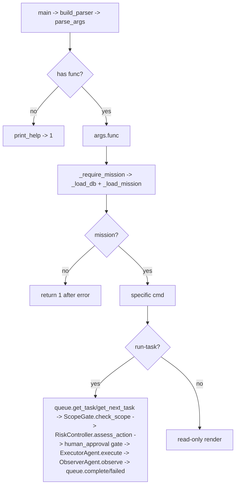

## Purpose

Deterministic, non-LLM CLI for Flow B's SQLite-backed research loop. Operates directly on `research_workspace/research.db` via `DatabaseManager` / `MissionController` / `TaskQueue` / `ScopeGate` / `RiskController` / `ExecutorAgent` without the autonomous `AgentLoop`. Intended for headless/CI, manual triage, and replay of individual tasks.

## Source Files

| File | Lines | Role |
|------|-------|------|
| `cli.py` | 599 | Arg parsing, 11 subcommands, DB + mission helpers |

Flow B file (per AGENTS.md §2, do not add new features here — it is frozen as `legacy` namespace).

## Responsibilities

- Resolve workspace root from `RESEARCH_WORKSPACE` env or `research_workspace/` (`cli.py:42` `_workspace_root`).
- Open the research DB (`cli.py:46` `_load_db` → `DatabaseManager(workspace/research.db)`).
- Resolve the active mission: load by `--mission-id` if given (status `active` or `paused`), else latest `active` (`cli.py:51` `_load_mission`, `cli.py:74` `_require_mission`).
- Implement 11 subcommands (see Public Interfaces) that read/write the same schema `AgentLoop` uses, preserving atomicity and scope/risk gates.

## Public Interfaces

### Workspace / DB helpers

| Function | Location | Signature | Description |
|----------|----------|-----------|-------------|
| `_workspace_root` | `cli.py:42` | `() -> Path` | Env-aware workspace root |
| `_load_db` | `cli.py:46` | `() -> DatabaseManager` | Opens `research.db` |
| `_load_mission` | `cli.py:51` | `(db, mission_id?) -> dict\|None` | SELECT missions by id or latest active |
| `_require_mission` | `cli.py:74` | `(args) -> (db, mission)` | Loads DB + mission; prints context-accurate error if missing |
| `_get_mission_ctrl` | `cli.py:92` | `(db) -> MissionController` | Factory |

### Subcommands (each is `func(args) -> int` wired in `build_parser`)

| Command | Function | Location | Description |
|---------|----------|----------|-------------|
| `init-mission` | `cmd_init_mission` | `cli.py:100` | `yaml.safe_load` → `MissionController.create_from_config` → prints mission summary |
| `add-scope` | `cmd_add_scope` | `cli.py:137` | Insert `allow`/`deny` scope rule (`_classify_asset` + `db.add_scope_rule`) |
| `list-scope` | `cmd_list_scope` | `cli.py:165` | `ScopeGate.list_scope()` render of allow/deny + forbidden actions |
| `next-task` | `cmd_next_task` | `cli.py:205` | `TaskQueue.get_next_task()` — highest-priority pending |
| `list-tasks` | `cmd_list_tasks` | `cli.py:231` | `list_open_tasks` + `list_blocked_tasks` + `count_by_status` |
| `run-task` | `cmd_run_task` | `cli.py:264` | Scope→risk→human-approval gates → `ExecutorAgent` → `queue.complete_task`/`failed` → `ObserverAgent` + `summarize_observation` |
| `summarize-target` | `cmd_summarize_target` | `cli.py:378` | `MemoryManager.summarize_target` + `TargetGraph.summarize_graph` |
| `list-findings` | `cmd_list_findings` | `cli.py:400` | `FindingVerifier.list_all()` |
| `validate-finding` | `cmd_validate_finding` | `cli.py:424` | `FindingVerifier.validate_finding` with `ScopeGate` + `EvidenceStore` |
| `generate-report` | `cmd_generate_report` | `cli.py:449` | `ReportGenerator.generate_report` |
| `status` | `cmd_status` | `cli.py:469` | `TaskQueue.count_by_status` + `FindingVerifier.list_all` rollup |

### Parser / Entrypoint

| Function | Location | Signature |
|----------|----------|-----------|
| `build_parser` | `cli.py:504` | `() -> ArgumentParser` (shared `--mission-id` parent parser for 10 subcommands; `init-mission` has `--config` required) |
| `main` | `cli.py:578` | `(argv=None) -> int` (dispatches `args.func`, handles `KeyboardInterrupt`/traceback) |

## Inputs/Outputs

| Input | Notes |
|-------|-------|
| `mission.yaml` | YAML config for `init-mission` (`yaml.safe_load`) |
| `--mission-id M-...` | Optional on 10 commands; selects specific mission (resume/attach) |
| `--allow/--deny` + `--notes` | `add-scope` pattern |
| `task_id` positional | `run-task [task_id]`; empty means next pending |
| `finding_id` positional | `validate-finding` / `generate-report` |

| Output | Notes |
|--------|-------|
| stdout text | Human-readable summaries, task/finding listings, reports |
| Exit code | 0 success, 1 error, 130 on `KeyboardInterrupt` |
| DB mutations | `research.db` + workspace dirs |
| Evidence files | `research_workspace/<mission_id>/evidence/` via `EvidenceStore` |

## State/Persistence

- All reads/writes go through `DatabaseManager` against `research_workspace/research.db` (single DB, many missions).
- `research_workspace/<mission_id>/` dirs (evidence/raw_output, http_responses, screenshots, notes, artifacts, reports, logs, tasks) created by `MissionController._init_workspace`.
- `run-task` writes: `tasks.status`, `observations`, `memories`, `graph_nodes/edges`, `findings`, `audit_logs`, `evidence` rows + files.

## Configuration

- Workspace root from `RESEARCH_WORKSPACE` env; default `research_workspace/`.
- Mission risk profile, budgets (`max_commands_per_session`, `max_tasks_active`), and scope rules come from the persisted `missions` row and `scope_rules` table, not `config.yaml` (Flow B uses `mission.yaml` only at creation).
- No `config.yaml` keys are read here.

## Dependencies

- `db.DatabaseManager` — connection, schema, `add_scope_rule`, `get_scope_rules`, `log_audit`
- `mission.Mission` (`from_dict`, `_classify_asset`), `mission.MissionController`
- `scope_gate.ScopeGate` — `load_from_db`, `check_scope`, `list_scope`
- `risk_controller.RiskController` — `assess_action`
- `tool_router.ToolRouter` — only in `cmd_run_task` via a stub executor (`lambda name,args: "[tool] ..."`)
- `executor.ExecutorAgent`, `observer.ObserverAgent`, `summarizer.summarize_observation`
- `evidence.EvidenceStore`, `memory.MemoryManager`, `target_graph.TargetGraph`, `finding_verifier.FindingVerifier`, `report_generator.ReportGenerator`, `task_queue.TaskQueue`
- `PyYAML`

## Used By

- Operator directly: `python cli.py <command> [--mission-id M-...]`
- Tests exercising Flow B deterministically without LLM.
- Not used by Flow A (`main.py`/`app.py`).

## Control Flow

`run-task` scope/risk/approval flow mirrors `agent_loop.py:607-642` and `cli.py:293-341`:

1. `ScopeGate.check_scope(asset=target, action_type=phase, tool=first_allowed, risk_level)`
2. `RiskController.assess_action(phase, first_tool, json(task)[:300], target, risk_level)`
3. If either sets `requires_human_approval`, mark `needs_approval` and bail (H16).

## Failure Modes

| Failure | Handling |
|---------|----------|
| No active mission | `ERROR: No active mission found. Run init-mission first.` → 1 |
| `--mission-id` not found | `ERROR: No mission with id ...` → 1 |
| Bad `mission.yaml` | `yaml.safe_load` may throw; `Mission.validate` raises `ValueError` → prints and 1 |
| `run-task` scope blocked | `queue.block_task(task_id, reason)` → 1 |
| `run-task` risk blocked | `queue.block_task` → 1 |
| `run-task` needs human approval | `queue.update_task_status(needs_approval)` → 1 (stub executor has no handler) |
| Unknown task/finding id | `ERROR: Task ... not found.` → 1 |

## Invariants

- `_require_mission` is the single chokepoint for mission resolution; all 10 mission-operating commands use it.
- `init-mission` never takes `--mission-id` (it mints a new `M-...`).
- `list-scope`'s `ScopeGate` is constructed from the DB mission's `allowed_assets/disallowed_assets/forbidden_actions/risk_profile` — not from CLI args.
- `run-task` never executes without going through `ScopeGate` then `RiskController`.

## Security Boundaries

- Every `run-task` execution is scope-gated (`ScopeGate`) and risk-gated (`RiskController`).
- `ScopeGate` enforces: deny-rules first, allow-rules required, forbidden-action exact + substring hard-blocks, third-party flag, sliding-window rate limit (`_RateBucket`), and high-risk human-approval flag.
- `RiskController` enforces: task/command budgets, action-category permission (`exploit`/`pivot`/`credential`), destructive-pattern deny, dangerous-tool deny, high-risk profile gate.

## Tests

| Test file | Covers |
|-----------|--------|
| `tests/test_cli_mission_id.py` | `--mission-id` parent parser, resume by id vs latest active, `init-mission` exclusion |
| `tests/test_mission.py` | `Mission.validate`, `_classify_asset`, normalization, controller creation |
| `tests/test_task_queue.py` | `create_task`/`get_next_task`/`block`/`reset_stale` used by `next-task`/`list-tasks`/`run-task` |
| `tests/test_agent_loop.py` | Loop-parity: task lifecycle + scope/risk gates |

Run: `python -m pytest tests/test_cli_mission_id.py tests/test_agent_loop.py -v`

## Common Changes

| Change | Where |
|--------|-------|
| Add a subcommand | `cli.py:504` `build_parser` subparser + new `cmd_*` function + wire `set_defaults(func=...)` |
| Change mission resolution | `cli.py:51` `_load_mission` / `cli.py:74` `_require_mission` |
| Adjust scope rendering | `cli.py:165` `cmd_list_scope` |
| Extend run-task pipeline | `cli.py:264` `cmd_run_task` (keep scope→risk→approval ordering) |

## Update This Document When

- A subcommand is added, removed, or changes its arguments/DB writes.
- `--mission-id` handling or active-mission selection changes.
- `run-task` pipeline (gates, executor/observer wiring) is altered.

## Related Documentation

- `docs/architecture.md` §Entry Points — `cli.py` commands
- `docs/runtime-flows.md` §Database-Backed Research Loop
- `agent_loop.py` (`docs/components/flow-b/agent-loop.md`) — autonomous version of the same loop
- `docs/database-mission.md` — DB layout + mission persistence
