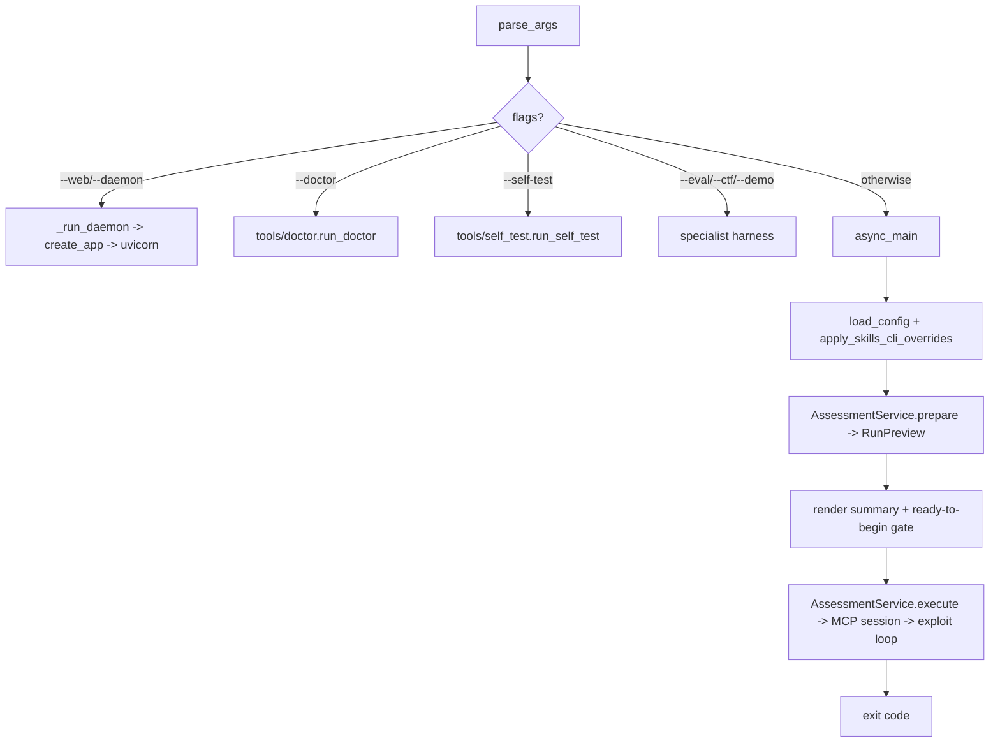

## Purpose

Primary launcher for Flow A. Parses every CLI flag, loads `config.yaml`, bootstraps API keys and the ChatGPT provider runtime (bun + `oauth/`), and dispatches to the WebUI daemon, doctor/self-test/demo/eval/ctf, or the MCP-backed `AssessmentService` exploit/recon session. Delegates real work to `tools/run_service`, `tools/mcp_session`, and `tools/exploit_session` so `main.py` stays thin.

## Source Files

| File | Lines | Role |
|------|-------|------|
| `main.py` | 1151+ | CLI adapter over `AssessmentService`; arg parsing, daemon boot, provider setup, telemetry |

Re-wrapped helpers (module-level re-exports for test patch points):

| Symbol in `main.py` | Real impl |
|---------------------|-----------|
| `open_exploit_mcp_session` (`main.py:102`) | `tools/mcp_session.open_exploit_mcp_session` |
| `run_exploit_session` (`main.py:148`) | `tools/exploit_session.run_exploit_session` |
| `run_safety_review` (`main.py:207`) | `tools/safety_review_cli.run_safety_review` |
| `run_recon_assessment` (`main.py:315`) | `tools/recon_assessment_cli.run_recon_assessment` |
| `bootstrap_startup_api_keys` (`main.py:56`) | `tools/config_cli.bootstrap_startup_api_keys` |

## Responsibilities

- Define the full `argparse` surface (`main.py:334` `parse_args`): targeting (`--target/--mode/--goal`), API keys, output, swarm/reasoning, operational (`--doctor/--self-test/--eval/--ctf/--demo/--resume`), skills, plugins, WebUI (`--daemon` (legacy alias: `--demon`)/`--web`).
- Start the WebUI API daemon (`main.py:708` `_run_daemon`) with loopback-only bind, optional WebUI build (`main.py:464` `_ensure_webui_build`), and bearer-token gate.
- Ensure ChatGPT provider prerequisites (`main.py:551` `_ensure_chatgpt_runtime`): bun install, `oauth/` clone + `bun install` + `bun run build`.
- Provide `async_main(args)` (`main.py:794`) — the CLI adapter that builds a `RunRequest`, calls `AssessmentService.prepare` → renders summary via `AttackUi` → asks ready-to-begin confirmation → calls `AssessmentService.execute`.
- Emit per-run LLM telemetry (`main.py:222` `_llm_usage_line_count`, `main.py:269` `_run_telemetry`) from `llm_usage.jsonl`.

## Public Interfaces

### Constants / Globals

| Symbol | Location | Notes |
|--------|----------|-------|
| `__version__` | `main.py:11` | `"0.49.12"` |
| `MCP_BOOT_TIMEOUT_SECONDS` | `main.py:98` | Re-export of `tools.mcp_session.MCP_BOOT_TIMEOUT_SECONDS` |
| `ui` | `main.py:46` | `tools.attack_ui.get_ui()` singleton |

### Functions

| Function | Signature | Description |
|----------|-----------|-------------|
| `bootstrap_startup_api_keys` | `main.py:56` `(args, prompt=False)` | Delegates to `tools/config_cli.bootstrap_startup_api_keys` |
| `_log_nested_exceptions` | `main.py:67` `(exc, prefix="")` | Recursive `BaseExceptionGroup` unpacker (uses `tools/exceptions`) |
| `open_exploit_mcp_session` | `main.py:102` `async @contextmanager (transport, config_path, target_ip, ...)` | Re-wrapped MCP boot session |
| `_elapsed_ticker` | `main.py:132` `async (label, interval, heartbeat)` | Ticker helper |
| `run_exploit_session` | `main.py:148` `async (client, model, target_ip, mode, goal, ...)` | Single-target exploit session wrapper |
| `run_safety_review` | `main.py:207` `async (client, model, result, target_ip, goal)` | Recon safety review |
| `run_recon_assessment` | `main.py:315` `async (*, session, target_ip, reports_dir)` | Recon pipeline assessment |
| `parse_args` | `main.py:334` `(argv) -> Namespace` | Full CLI parser (see arg groups) |
| `_ensure_webui_build` | `main.py:464` `(ui) -> int` | `npm install && npm run build` if `webui/dist/index.html` missing |
| `_install_bun` | `main.py:502` `(ui) -> bool` | Best-effort bun install via npm / PowerShell / curl |
| `_ensure_chatgpt_runtime` | `main.py:551` `(args) -> int` | Bun + oauth checkout + workspace build gate for `models.provider: chatgpt` |
| `_open_browser_when_ready` | `main.py:673` `(host, port, ui)` | Loopback health-poll then `webbrowser.open` (daemon thread) |
| `_api_daemon_ready` | `main.py:696` `(host, port) -> bool` | Health-probe for running daemon |
| `_run_daemon` | `main.py:708` `(args) -> int` | Validates loopback bind, checks port, optionally builds WebUI, runs `uvicorn` |
| `async_main` | `main.py:794` `async (args) -> int` | Service adapter: builds `RunRequest`, calls `AssessmentService.prepare`/`execute` |
| `main` | `main.py:1031` `(argv=None) -> int` | Top-level dispatch: `--web/--daemon`, `--doctor/--self-test/--eval/--ctf/--demo`, `async_main` |

## Inputs/Outputs

| Input | Type | Notes |
|-------|------|-------|
| `argv` | `list[str]` | CLI args; defaults to `sys.argv[1:]` |
| `config.yaml` | file | Loaded via `tools/config_cli.load_config` |
| Env `OLLAMA_API_KEY`, `BREACHPILOT_API_TOKEN`, `RESEARCH_WORKSPACE` | env | Provider auth / API token / workspace root |
| MCP transport | `stdio` / `http` | Forced to `http` on run path for target-IP lock |

| Output | Type | Notes |
|--------|------|-------|
| Exit code | `int` | 0 success, 1 error, 2 bad args, 130 aborted |
| Reports | `reports/<run_id>/` | Per-run artifacts via `AssessmentService` |
| `llm_usage.jsonl` | JSONL | Model telemetry tail |
| Daemon | `uvicorn` on `127.0.0.1:8765` | When `--daemon` (legacy alias: `--demon`)/`--web` |

## State/Persistence

- No DB writes directly; delegates to `AssessmentService` / `ApiPersistence` / `RunManager`.
- In-memory `Callables` bundle (`main.py:895`) threads patched symbols into service for test monkeypatching.
- WebUI token file `.webui_secret_key` (gitignored) loaded/created via `tools/api/auth.load_or_create_token`.

## Configuration

All behavior via `config.yaml` top-level keys (see README §Configuration):

- `models.provider` (`ollama` default | `chatgpt`), `ollama.host` (`https://api.ollama.com`), `ollama.embed_host`
- `mcp`, `nmap`, `exploit` (permission, attack_mode, timeouts, `allowed_targets`), `swarm`, `api` (host/port, `event_buffer_size`, `serve_webui`, `multi_operator`)
- CLI flags override config; `apply_skills_cli_overrides` merges `--skills*`.

## Dependencies

- `tools/config_cli` (`load_config`, `bootstrap_startup_api_keys`, `add_target_to_allowlist`)
- `tools/mcp_session` (`open_exploit_mcp_session`, `mcp_tools_to_ollama`, `MCP_BOOT_TIMEOUT_SECONDS`)
- `tools/exploit_session` (`run_exploit_session`)
- `tools/run_service` (`AssessmentService`, `Callables`, `RunRequest`, `TerminalDecisionProvider`, `TerminalEventSink`)
- `tools/goal_engine.GoalEngine`, `tools/model_router.build_router`, `tools/safety_reviewer.SafetyReview`, `tools/attack_ui.get_ui`, `tools/exceptions._EXC_GROUP_CATCH`
- `app.create_app` (via `_run_daemon`), `uvicorn`, `webbrowser`, `shutil`/`subprocess` for WebUI build

## Used By

- Operator directly: `python main.py ...` (default entry point)
- Tests monkeypatch `main.open_exploit_mcp_session`, `main.run_exploit_session`, `main.build_router`, etc.
- `app.py` is invoked *from* `main._run_daemon`

## Control Flow

## Failure Modes

| Failure | Symptom | Handling |
|---------|---------|----------|
| Missing `OLLAMA_API_KEY` (cloud) | Auth 401 on first chat | Surfaced as model error; `--doctor` hints |
| `bun`/oauth checkout missing (chatgpt) | `_ensure_chatgpt_runtime` returns 1 | Early exit before session; errors via `ui.error` |
| MCP boot timeout / `BaseExceptionGroup` | Subprocess death | Caught via `_EXC_GROUP_CATCH` + `_log_nested_exceptions`; logged to `session_error.log` |
| Non-loopback `--api-host` | Immediate error | `_run_daemon` returns 2 |
| No target provided | `ui.error("No target")` | Exit 1 |
| WebUI `npm`/`node` missing | Build error | `_ensure_webui_build` returns 1 with hint |

## Invariants

- `main.py` never calls Ollama directly; all LLM I/O through `build_router` / `run_exploit_session`.
- `--daemon` (legacy alias: `--demon`)/`--web` mutually exclusive with `--target/--mode/--goal/--doctor/--self-test` (exit 2).
- Missing-key exploit permission falls back to `read_only` (via `tools/cli_exploit_settings`), never `full_access`.
- Fast path always forces MCP transport to `http` so target-IP lock reaches server.

## Security Boundaries

- API daemon is **loopback-only** (`127.0.0.1/localhost/::1`); public bind refused.
- Bearer token from `.webui_secret_key` or `BREACHPILOT_API_TOKEN` guards `/api/v1`.
- Allowlist lock: `AssessmentService.prepare` resolves domain→IP and persists new domain IP to `config.yaml` exploit allowlist for interactive sessions.
- `full_access` is the lab attack posture; recon stays `read_only`.

## Tests

| Test file | Covers |
|-----------|--------|
| `tests/test_main_fixes.py` | Arg groups, daemon mutual-exclusion, exit codes, monkeypatched callables |
| `tests/test_config_cli.py` | `load_config`, bootstrap API keys, allowlist add |
| `tests/test_doctor.py` | `--doctor` probe path |
| `tests/test_self_test.py` | `--self-test` smoke path |

Run: `python -m pytest tests/test_main_fixes.py tests/test_config_cli.py -v`

## Common Changes

| Change | Where |
|--------|-------|
| Add a CLI flag | `main.py:334` `parse_args` + `RunRequest` in `tools/run_service/models.py` + `async_main` wiring |
| New daemon behavior | `main.py:708` `_run_daemon` + `app.py:42` `create_app` |
| Support new provider | `main.py:551` `_ensure_chatgpt_runtime` + `tools/model_router._build_model_client` |

## Update This Document When

- A top-level CLI flag, arg group, or mutual-exclusion rule is added/removed.
- Daemon/WebUI boot, ChatGPT runtime setup, or telemetry tail changes.
- `async_main`'s `RunRequest` construction or `Callables` bundle changes.

## Related Documentation

- `docs/architecture.md` §Entry Points / Flow A
- `docs/runtime-flows.md` §Exploit Session / Recon-First / Domain Targeting
- `docs/cli-reference.md` — full flag reference
- `app.py` (`docs/components/root/app.md`), `tools/run_service/service.py`, `tools/mcp_session.py`, `tools/exploit_session.py`
