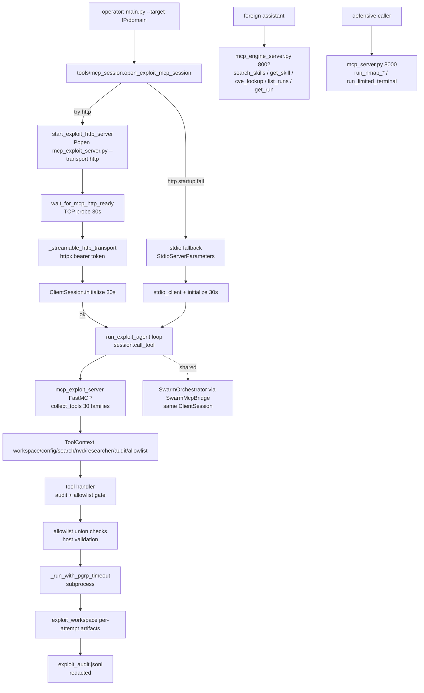

# MCP Subsystem Overview

Three MCP servers share one lifecycle, one transport hardening layer, and one security model. Two flows coexist: Flow A (`main.py`/`app.py` → exploit agent / swarm) is what users run; Flow B is the frozen defensive/SQLite loop.

## Topology

| Server | File | FastMCP name | Role | Tools | Default HTTP port |
|--------|------|--------------|------|-------|-------------------|
| Defensive (legacy) | `mcp_server.py` | `ai-nmap-defensive` | Scope-enforced Nmap scanning against `research.allowed_assets` | 8 Nmap/intel tools | `8000` (`mcp_server.py:346-349`) |
| Exploit | `mcp_exploit_server.py` | `AI Exploitation Tools` | Permissive exploitation surface for the exploit agent / recon-first paths; ~120 tools across 30 families | 30 families in `tools/mcp_tools/` (24 top-level incl. `terminal/` + 6 in `modules/`) | `8001` (`mcp_exploit_server.py:206-208`) |
| Engine | `mcp_engine_server.py` | `breachpilot-engine` | Read-only advisory + history for foreign assistants (Claude Desktop, Cursor) | 5 tools | `8002` (`mcp_engine_server.py:200-203`) |

All three call `tools.mcp_shared.run_mcp_http_server` (`tools/mcp_shared.py:384-405`) for HTTP: `mcp.streamable_http_app()` + `uvicorn.run` with loopback gate and optional `MCP_HTTP_TOKEN` bearer auth.

## Transports

- **stdio** (default): `stdio_client` + `ClientSession` (`tools/mcp_session.py:325-328`). Used by recon-first fallback and direct `python mcp_*.py --transport stdio`.
- **streamable HTTP**: `streamable_http_client` over `httpx.AsyncClient` (`tools/mcp_session.py:720-742`). `trust_env=False` so loopback is never proxied; `read` timeout 1800s covers long tool calls.
- Run path is forced to `http` (`tools/run_service/service.py:1059`); `main.py --mcp-transport` is ignored on the run path. CLI flag `--transport` still works for standalone launches.

HTTP ports come from `config.yaml` (`nmap.timeout` for defensive, `mcp.http_port` for exploit via `tools/mcp_session.py:623-634`). All servers support `--allow-public-bind` which requires **both** flag and `MCP_ALLOW_PUBLIC_BIND=1` env var (two-person rule, `tools/mcp_shared.py:334-350`).

## Mermaid Diagram

## Lifecycle Overview

1. `tools/mcp_session.open_exploit_mcp_session` (`tools/mcp_session.py:117-196`) orchestrates boot. HTTP is tried first with `startup_soft_fail=True`; only HTTP-startup failures fall back to stdio. A live HTTP session is never replaced after `yield`.
2. Each boot path caps `ClientSession.initialize()` at `MCP_BOOT_TIMEOUT_SECONDS = 30` (`tools/mcp_session.py:32`).
3. Mid-session death is caught with `_EXC_GROUP_CATCH` (`tools/exceptions.py:38-41`) so `BaseExceptionGroup` from anyio task groups is not silently missed.
4. Env vars `EXPLOIT_TARGET` / `EXPLOIT_TARGET_IP` / `EXPLOIT_TARGET_DOMAIN` / `EXPLOIT_DISCOVERED_TARGETS` / `EXPLOIT_WORKSPACE` / `AI_NMAP_*` / `MCP_HTTP_TOKEN` are injected into the child (`tools/mcp_session.py:256-272`) and consumed by the allowlist lock.
5. The exploit server auto-discovers every `register_*_tools` via `tools/mcp_tools/registry.collect_tools` (`tools/mcp_tools/registry.py:391-405`) and validates `@audit_tool`/`@require_allowlist` via AST on every file (`tools/mcp_tools/registry.py:345-388`).

## Shared Kernel

Pure functions live in `tools/kernel/` and are re-exported for backwards compat:

- `tools/kernel/allowlist.py` — `_allowed_target_list`, `add_discovered_target`, `_check_allowlist`, `_extract_msf_rhosts`, `check_targets_allowlist`, `_extract_scanner_targets`
- `tools/kernel/audit.py` — `_redact_args`, `_mask_secret_content`, `_audit_log`, `make_audit_tool`, `make_require_allowlist`
- `tools/kernel/workspace.py` — `_is_inside_workspace`, `_resolve_workspace_file`, `_attempt_dir`, `read_workspace`

`tools/mcp_shared.py` re-exports them (`tools/mcp_shared.py:56-83`) and adds `_run_with_pgrp_timeout` (`tools/mcp_shared.py:235-317`) and the HTTP hardening helpers.

## Related Docs

- `docs/mcp/servers/defensive.md` — defensive server detail
- `docs/mcp/servers/exploit.md` — exploit server + discovery
- `docs/mcp/servers/engine.md` — engine advisory server
- `docs/mcp/lifecycle.md` — boot sequence diagram and timeouts
- `docs/mcp/registration.md` — decorator contract and AST validation
- `docs/mcp/security.md` — allowlist lock, audit, redaction
- `docs/mcp/tool-families/*.md` — per-family tool tables
- `docs/mcp-tools.md` — legacy combined tool reference (now split)
- `docs/mcp-wiring.md` — three-server wiring and client snippets
